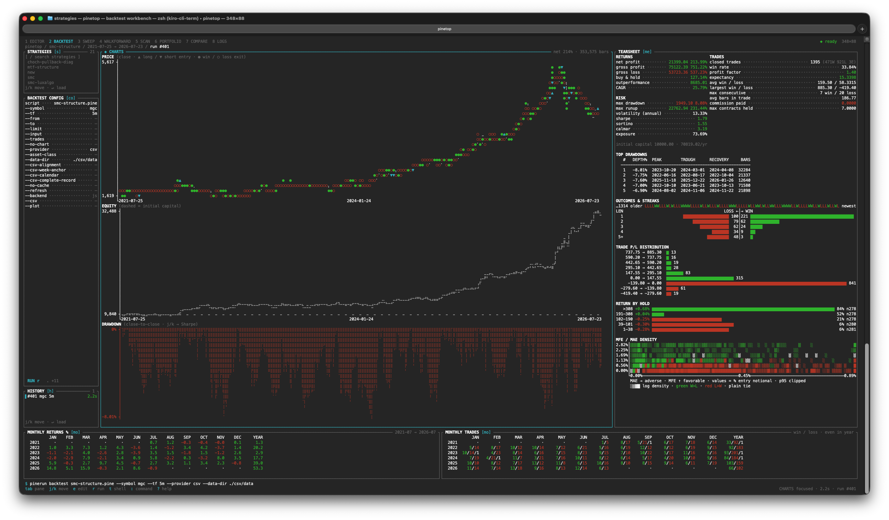

# pinestack

[](./LICENSE)

A programmable, parallel execution surface for the
[piner](https://github.com/heyphat/piner) Pine Script v6 engine. Where
TradingView keeps Pine inside one chart, one symbol, and one timeframe,
pinestack turns the engine into a headless stack for scanning universes,
backtesting strategies, sweeping parameters, validating walk-forward windows,
combining portfolios, and replaying strategies toward broker execution.

This is the "terminal" layer around the engine. piner stays a pure, browser-safe
library; pinestack adds the data, orchestration, interactive, and
forward-execution rings on top.

Two ways to drive it: `pinerun`, the one-shot CLI, and `pinetop`, a terminal UI
over that CLI for when you are iterating on the same script and want the source
and the flags editable next to the report instead of retyped each run.

## Install

Both binaries ship as single self-contained executables — the Bun runtime, the
piner engine, and the pinery data layer are all baked in, so there is nothing
else to install (no Node, no Bun, no npm):

```bash
curl -fsSL https://raw.githubusercontent.com/heyphat/pinestack/main/scripts/install.sh | sh
```

This downloads `pinerun` and `pinetop` for your platform from the
[latest release](https://github.com/heyphat/pinestack/releases/latest) and drops
them in `~/.local/bin`. Overrides: `PINESTACK_BINS` to install just one (e.g.
`PINESTACK_BINS=pinerun`), `PINESTACK_INSTALL_DIR` for the directory,
`PINESTACK_VERSION=v0.1.0` to pin a tag. Prebuilt targets: Linux and macOS on
x64/arm64, plus Windows x64 `.exe` files you can download directly from the
Releases page.

```bash
pinerun --version
pinerun --help
pinerun scan --help

pinetop --version        # also reports the pinerun it drives
pinetop                  # open the TUI; everything else is configured in it
```

Later, update either in place with `pinerun upgrade` / `pinetop upgrade` — each
downloads the latest release's binary for your platform, verifies its checksum
against the release's `checksums.txt`, and swaps the executable atomically
(`--check` to just look).

`pinetop` spawns `pinerun` for every number it shows, so keep both current.

> **Pinelive is not installed by default.** Releases also carry a standalone
> `pinelive` binary (the forward runner), but the installer only fetches it with
> an explicit opt-in — `PINESTACK_BINS="pinerun pinetop pinelive"` — because it
> can place orders. Paper is its default broker. The built-in official Tiger
> adapter is intentionally blocked and ineligible for armed production
> execution because it cannot prove complete open-order inventory,
> authoritative exact order absence, or closure of the snapshot/account-stream
> gap. See the [production-safety runbook](./docs/pinelive-production-safety.md)
> and [Paper quick start](./packages/pinelive/README.md#paper-quick-start).

Prefer to build them yourself? See [Getting started](#getting-started-with-pinerun) below, then
`bun run build:bin --install`.

## Packages

| Package                                    | Role                                                                                                                                                                                                                                                | Entry points                                                                                 |
| ------------------------------------------ | --------------------------------------------------------------------------------------------------------------------------------------------------------------------------------------------------------------------------------------------------- | -------------------------------------------------------------------------------------------- |
| [`@heyphat/pinery`](./packages/pinery)     | **Data layer.** OHLCV history providers (Binance spot/futures, OKX spot/swap, Kraken, Alpaca, Massive, static/CSV) implementing piner's `DataFeed` contract, canonical timeframe helpers, and a Node on-disk cache.                                 | `@heyphat/pinery` (browser-safe), `@heyphat/pinery/node`                                     |
| [`@heyphat/pinerun`](./packages/pinerun)   | **Orchestration layer.** The job model, a determinism cache, in-process and worker-thread runners, the ranker, the `scan` fan-out, and the `pinerun` CLI.                                                                                           | `@heyphat/pinerun` (browser-safe), `@heyphat/pinerun/node`, `pinerun` (CLI)                  |
| [`@heyphat/pinetop`](./packages/pinetop)   | **Interactive layer.** A terminal UI over the CLI: one page per `pinerun` command plus a vim editor for the `.pine`, flags editable in place, the report resident on screen. Computes nothing — it spawns `pinerun --json` and renders the payload. | `@heyphat/pinetop`, `pinetop` (TUI)                                                          |
| [`@heyphat/pinelive`](./packages/pinelive) | **Forward-execution layer.** Closed-bar runner, exact broker position mirror, PaperBroker, Tiger execution adapters, JSONL ledger, parity, and broker conformance utilities.                                                                        | `@heyphat/pinelive`, `@heyphat/pinelive/node`, `@heyphat/pinelive/testing`, `pinelive` (CLI) |

```
piner            (engine — separate repo, pure, browser-safe)
  ▲   ▲
  │   └── @heyphat/pinery   depends on piner (implements DataFeed / Bar)
  │            ▲    ▲
  │            │    └── @heyphat/pinelive   depends on piner + pinery (forward execution)
  └────────────┴── @heyphat/pinerun   depends on piner + pinery (orchestrates)
                       ▲        ▲
                       │        └── @heyphat/pinetop   spawns the pinerun CLI
                       │                               (and reuses its renderers)
                       └── consumers: the pinerun CLI, a charting frontend, your scripts
```

`piner` is declared a **peer dependency** of all four packages, so there is only
ever one engine copy in a consumer's tree. The `@heyphat/pinery`,
`@heyphat/pinerun`, `@heyphat/pinetop` and `@heyphat/pinelive` names describe
workspace/API entry points; pinestack's release artifacts are the self-contained
`pinerun` and `pinetop` binaries above, not separately published npm workspace
packages.

`pinetop` deliberately does **not** link the engine: it builds argv, spawns
`pinerun … --json`, and renders the result. That keeps one execution path, so the
numbers on screen and the numbers from the printed command cannot disagree.

## Repository layout

```text
pinestack/
├── package.json              workspaces root (packages/*)
├── bun.lock                  exact dependency + workspace metadata
├── tsconfig.base.json        shared compiler options (strict, ES2022, bundler res)
├── tsconfig.json             solution file: references every package (tsc -b)
├── scripts/
│   └── install.sh            release installer (pinerun + pinetop)
├── examples/                 .pine strategies + checked-in CSV replay fixtures
├── docs/                     command, portfolio, and forward-testing guides
└── packages/
    ├── pinery/               @heyphat/pinery   — providers in src/adapters/, cache behind /node
    ├── pinerun/              @heyphat/pinerun  — jobs, runners, commands, the pinerun CLI
    ├── pinelive/             @heyphat/pinelive — core mirror/ledger, Paper + Tiger brokers
    └── pinetop/              @heyphat/pinetop  — TUI pages, flag schema, spawns pinerun --json
```

The detailed public APIs live in each package README; this tree shows ownership
boundaries rather than every source file.

## Requirements

Source development uses **Bun 1.2.5**, matching the exact mainline CI and release
toolchain. The workspace installs `@heyphat/piner` from the npm registry as a
peer dependency.

The standalone `pinerun` binary does not require Bun, Node, or npm at runtime.

## Getting started with `pinerun`

Scaffold a starter strategy and backtest it on hourly BTC data:

```bash
pinerun init strategy.pine
pinerun backtest strategy.pine --symbol BTCUSDT --tf 1h --limit 500
```

`init` writes a runnable, commented SMA-crossover strategy; `backtest` runs it on
500 hourly BTC bars and prints a full tearsheet — returns, risk, and trade quality,
then monthly returns, monthly trade tallies, top drawdowns, and in-terminal
price / equity / drawdown charts (abbreviated here):

```text
  backtest: BTCUSDT @ 1h — 499 bars, 2026-06-21 → 2026-07-12

  RETURNS
    net profit                 -474.42      -4.74%
    gross profit                765.46       7.65%
    gross loss                 1239.88      12.40%
    buy & hold                               2.08%
    outperformance             -682.47
    CAGR                                   -57.50%

  RISK
    max drawdown                843.34       8.36%
    max runup                   827.41       8.95%
    volatility (annual)                     33.86%
    sharpe                       -2.36
    sortino                      -1.51
    calmar                       -6.88
    exposure                                53.51%

  TRADES
    closed trades                    9  (2W 7L 0E)
    win rate                                22.22%
    profit factor                 0.62
    …
```

From there: screen a universe with `pinerun scan`, optimize a parameter grid with
`pinerun sweep`, validate it out-of-sample with `pinerun walkforward`, or pool one
pot across symbols with `pinerun portfolio`. See the
[command reference](./docs/README.md) (or `pinerun <command> --help`) for every
flag, and [`packages/pinerun/README.md`](./packages/pinerun/README.md) for the
programmatic API.

Once you are iterating rather than running one-shot, `pinetop` puts those same
commands on eight pages with the flags editable beside the report — and page 1 is
a vim editor for the `.pine` itself, so the whole loop stays in one screen:

```bash
pinetop      # 1–8 pages · tab panes · ↵ edit a flag · r ↵ run · ? keys
             # page 1: the source, vim keys — i inserts, :w writes, tab leaves
```



## Paper forward replay

Pinelive can replay the checked-in BTC CSV through PaperBroker without contacting
a data or brokerage service. From a source checkout, follow the
[Paper quick start](./packages/pinelive/README.md#paper-quick-start): it uses
`examples/rsi-mean-reversion.pine`, `examples/data`, a 20-bar warmup, and the
source CLI.

The built-in official Tiger adapter is intentionally blocked and ineligible
for armed production execution because it cannot prove complete open-order
inventory, authoritative exact order absence, or closure of the
snapshot/account-stream gap. Its credentialed test is read-only and does not
authorize mutation. See the
[production-safety runbook](./docs/pinelive-production-safety.md).

### Developing from source

Requires [Bun](https://bun.sh) 1.2.5, matching CI and the release toolchain.

```bash
bun install --frozen-lockfile   # links workspaces + the piner peer
bun test                        # runs every package's test suite
bun run typecheck               # tsc -b across every package
bun packages/pinelive/src/cli.ts --help   # the forward CLI (also builds standalone)
```

Build a standalone binary from your checkout and drop it on your PATH with
`bun run build:bin --install` — run it inside `packages/pinerun` or
`packages/pinetop` to pick which one (or pass `--product pinerun|pinetop` from
anywhere).

## Design principles

1. **piner stays pure.** Parsing, code generation, strategy semantics, and the
   broker model remain in the engine; I/O and orchestration stay in pinestack.
2. **Data has one owner.** Pinery supplies historical and resolved forward data.
   Pinerun and pinelive consume its contracts instead of maintaining parallel
   fetch/replay implementations.
3. **Determinism is the moat.** A piner run is a pure function of
   `(source, bars, inputs, backend)`. That makes runs cacheable (`jobHash`),
   reproducible, and trivially parallel. Forward execution adds durable binding,
   order identity, and ledger evidence around the deterministic strategy state.
4. **Browser-safe cores, Node extras behind `/node`.** Filesystem caching, CSV
   construction, worker threads, JSONL, and official SDK adapters stay out of
   browser entry points.
5. **One engine copy.** `piner` is a peer dependency everywhere.
6. **One execution path.** The UI does not re-implement the engine or the CLI: it
   spawns `pinerun --json` and reuses the CLI's own chart and table renderers.
   A number can therefore never differ between what pinetop shows and what the
   command it prints would produce.
7. **Execution fails closed.** Exact instrument identity, arming, metadata,
   secondary-feed health, and unresolved-order state are checked before broker
   correction.

## Documentation

- [CLI command reference](./docs/README.md)
- [Pinery data API](./packages/pinery/README.md)
- [Pinerun analysis API](./packages/pinerun/README.md)
- [Pinetop TUI](./packages/pinetop/README.md)
- [Pinelive source quick start](./packages/pinelive/README.md)
- [Forward-testing guide](./docs/pinelive.md)
- [Release runbook](./RELEASING.md)

## License

[GNU AGPL-3.0](./LICENSE) © Phat Huynh.
