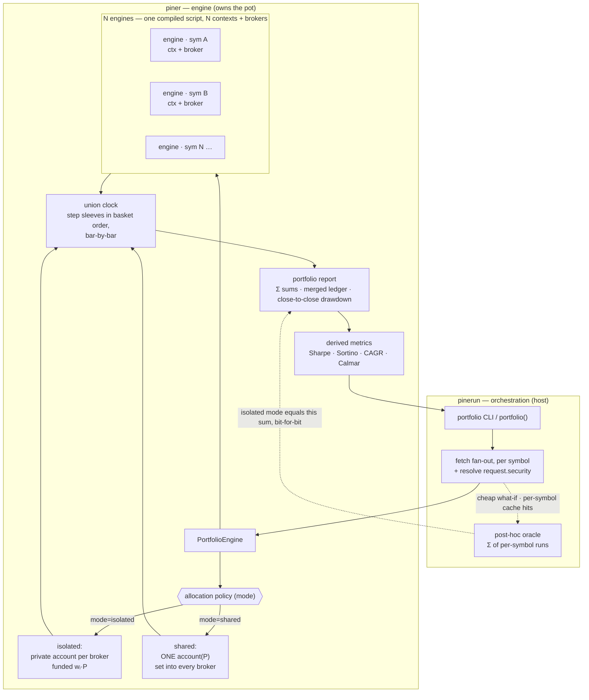
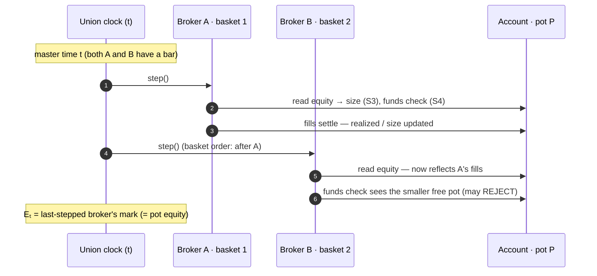

# How the portfolio model works

This explains what [`pinerun portfolio`](./portfolio.md) actually computes — the
capital models, the union clock, the per-bar execution order, and the exact
identities behind the numbers. For the command's flags and examples, see the
[`portfolio` reference](./portfolio.md); this page is the semantics.

The engine that owns the capital model lives in piner (`PortfolioEngine`);
pinerun is the host that fetches history, drives the run, and prints the report.
piner's `docs/portfolio-semantics.md` is the authoritative spec — the rules
below (labelled **S1–S9**) mirror it so tests and docs can cite them.

## The basket, the sleeve, the pot

You give one Pine **strategy**, one timeframe/range, and **N symbols**. Each
symbol is a **sleeve** — the strategy running on that symbol's bars, with its own
position, series, and `barstate`, exactly as a single-symbol run would see them.
The **pot** `P` is the shared starting capital (`--capital`, default `N · C`
where `C` is the script's `strategy()` `initial_capital`).

The whole point: `scan` answers _"which symbol is best?"_; portfolio answers
_"what happens if I run this strategy on all of them at once, out of one
account?"_

## Data flow

pinerun fetches and hosts; piner owns the capital model. The post-hoc sum
(oracle) is the same arithmetic run separately — a cheap what-if that `isolated`
mode reproduces exactly.



## Two capital models

`--mode` selects how the sleeves share the pot.

### `isolated` (default)

N independent sub-accounts. Sleeve `i` is funded `wᵢ · P` (equal by default, or
per `--weights`), trades entirely on its own account, and the portfolio is the
**sum** of the sleeves — capital is never reallocated; an idle sleeve's cash
can't fund a busy one. This reproduces the classic per-symbol runs summed, **bit
for bit**:

```
portfolioEquity(t) = Σᵢ equityᵢ(t)
portfolioNetProfit = Σᵢ netProfitᵢ
```

### `shared`

**One pot.** All sleeves draw on a single account: `percent_of_equity` sizing,
the funds check, margin, and `strategy.risk.*` rules all read **portfolio**
equity, and sleeves fill sequentially in basket order at each timestamp. One
symbol's gains fund another's next entry; an order can be rejected because an
earlier sleeve already spent the cash.

### Why shared mode is a _different_ backtest

A shared pot changes **which trades happen**, not just how equity is totalled, so
it is not a superset of the isolated sum:

- Under `percent_of_equity` sizing, symbol `i`'s gains inflate symbol `j`'s next
  entry size (sizing reads pot equity).
- `strategy.risk.max_drawdown` / `max_intraday_loss` trip on **portfolio**
  equity, not sleeve equity.
- If capital binds, fills get blocked that the isolated run would have taken.

An explicit allocation policy is what lets the two modes coexist cleanly:

| Mode / config              | Reproduces                                       |
| -------------------------- | ------------------------------------------------ |
| `isolated`, equal funding  | equal-weight sleeves, exactly                    |
| `isolated`, `--weights wᵢ` | weighted allocation (`wᵢ·P` per sleeve), exactly |
| `shared`                   | the genuinely new, capital-coupled backtest      |

> **Weights are applied by re-funding, not by rescaling.** Funding sleeve `i` at
> `wᵢ·P` and re-running is exact for every sizing/commission/risk configuration.
> Scaling an existing `C`-run curve (`P + k·(equity − C)`) is only valid when PnL
> is exactly linear in starting capital — which breaks for `cash`/`fixed` sizing,
> `cash_per_order` commission, absolute `strategy.risk.*` rules, and any explicit
> per-order `qty=` (unknowable until runtime). So the engine re-runs.

## The union clock

Symbols differ in start date, gaps, and length. The **master clock** is the
sorted, deduped union of every sleeve's bar times. Each sleeve's equity is
**forward-filled** onto it: before its first bar it holds its cash `Cᵢ`; in a gap
or after its last bar it carries its last mark (a ragged tail). Nothing is
truncated — the portfolio runs to the longest sleeve's last bar.

```
                t0    t1    t2    t3    t4    t5
  A bars:       ●     ●     ●     ·     ●     ·     (gap at t3; A ends at t4)
  B bars:       ●     ·     ●     ●     ●     ●     (B has no t1 bar; runs to t5)

  A aligned:    a0    a1    a2   [a2]   a4   [a4]   [·] = forward-filled (carry last)
  B aligned:    b0   [b0]   b2    b3    b4    b5

  portfolio Eₖ: a0+b0 a1+b0 a2+b2 a2+b3 a4+b4 a4+b5   (isolated: literally Σ)
```

**Pre-activation is cash, not zero.** A sleeve that hasn't started trading still
holds its capital, so `E₀ = Σᵢ Cᵢ = P` exactly. Seeding the fill at `0` would
understate early equity.

## Per-bar execution order (shared mode)

At each master timestamp, the sleeves that have a bar there step **in basket
order** (the `--symbols` order — deterministic). Under a shared pot, an earlier
sleeve's fills settle into the account _before_ the next sleeve sizes, so sizing
and the funds check see the capital the earlier sleeve just consumed. That
coupling is what makes shared mode diverge from N independent runs:



In `isolated` mode each sleeve has its own account, so these arrows never cross
sleeves and the portfolio curve is exactly the sum of the independent sleeve
curves.

## Semantics reference (S1–S9)

Guiding principle: **per-sleeve TradingView fidelity is preserved; only the
account is shared.** A sleeve's script sees its own symbol's bars, series, and
position exactly as a single-symbol run — except where account state is
explicitly portfolio-level.

- **S1 — Funding.** The shared account opens with `P`. In isolated mode each
  sub-account opens with `wᵢ·P`.
- **S2 — Account read-backs are portfolio-level.** Inside a sleeve's script,
  `strategy.initial_capital`, `strategy.equity`, and the `*_percent` denominators
  read the **pot**. Own-trade quantities (`strategy.netprofit`,
  `strategy.openprofit`, the trade lists) stay **per-sleeve** — pooling them
  would N-times overcount and destroy attribution. So the single-symbol identity
  `equity = initial_capital + netprofit + openprofit` holds at the portfolio
  level, not inside a sleeve (intended).
- **S3 — Sizing draws on shared equity.** `percent_of_equity` sizes against pot
  equity at the sleeve's fill moment. `fixed` / `cash` / explicit `qty=` are
  unchanged.
- **S4 — Funds check and fill ordering are first-come-first-served** in basket
  order at each master timestamp. A rejected order is rejected exactly as
  single-symbol TradingView rejects it — no queueing, no partial fills.
- **S5 — Intrabar convention.** Each sleeve walks its own bar's assumed intrabar
  path sequentially, in basket order, against account state as of its turn.
  Cross-symbol intrabar interleaving is unknowable from OHLC and is **not**
  modeled (see drawdown, below).
- **S6 — Margin is per-sleeve against shared cash.** Each sleeve's
  `margin_long/short` gates its own orders and computes its own liquidation price
  using pot equity as the funds base; the 4× liquidation applies per sleeve.
  There is **no cross-symbol netting** — a liquidation never closes another
  sleeve's position.
- **S7 — Risk rules are portfolio-level.** `strategy.risk.max_drawdown` and
  `max_intraday_loss` evaluate on pot equity. Every pot mark is broadcast to
  every sleeve's peak/valley/day-max trackers, so a sleeve whose clock misses the
  pot's peak bar still observes it and trips at its own next bar — the portfolio
  halts within one bar per sleeve, on any clock. Contract-denominated rules
  (`max_position_size`) stay per-sleeve.
- **S8 — Barstate and clock are per-sleeve.** A sleeve executes only on its own
  bars (no phantom bars at master times where it has none); `barstate.*`,
  `bar_index`, and series history match a single-symbol run.
- **S9 — One quote currency.** All symbols are assumed to settle in one currency;
  no FX conversion (asserted, not converted).

Orders always target the sleeve's own symbol — Pine has no syntax for anything
else, so this is structural, not a restriction.

## The math

Notation: `P` pot; `wᵢ` funding weight (`Σwᵢ = 1`); `Cᵢ = wᵢ·P` sleeve funding /
pre-activation cash; `sizeᵢ` signed contracts; `avgPriceᵢ` average entry;
`realizedᵢ` booked PnL; `mᵢ` margin fraction; `Eₖ` portfolio equity at master
index `k`.

### Funding (S1)

```
P  = capital                       (default N · C)
wᵢ = rawWeightᵢ / Σⱼ rawWeightⱼ    (normalized; default 1/N)
Cᵢ = wᵢ · P                        (isolated: each sub-account's capital)
                                   (shared:   0 per sleeve — the pot P is the account)
```

### Position sizing (S3)

```
percent_of_equity :  qty = (qtyValue/100) · equity / price   ← equity is the POT in shared mode
cash              :  qty = qtyValue / price
fixed             :  qty = qtyValue
explicit qty=     :  qty = order.qty                          ← overrides the above
```

Only `percent_of_equity` reads `equity`; that single dependency is why a shared
pot changes the trade set.

### The account equity identity (the heart of it)

The account holds no PnL of its own; it sums the attached sleeves on demand:

```
equity(t)   = P + Σᵢ realizedᵢ(t) + Σᵢ openProfitᵢ(t)
openProfitᵢ = sizeᵢ · (valPriceᵢ − avgPriceᵢ)
valPriceᵢ   = closeᵢ(t)  if sleeve i has a live bar at t   (own bar in progress)
            = lastMarkᵢ  otherwise                         (stale close between its bars — S5)
```

With a single sleeve (isolated / lone broker) this collapses to the exact
single-symbol formula `equity = Cᵢ + realizedᵢ + openProfitᵢ`, in the same
floating-point order — which is why the isolated portfolio reproduces the
per-symbol sum bit for bit.

### Funds check & margin (S4, S6)

An entry/increase of `qty` at `price` for sleeve `i` is accepted iff:

```
base         = P + Σⱼ realizedⱼ + Σ_{j≠i} openProfitⱼ            (own open PnL excluded)
equityAtFill = base + sizeᵢ · (price − avgPriceᵢ)
required     = price · (|sizeᵢ| + qty) · mᵢ  +  Σ_{j≠i} |sizeⱼ| · valPriceⱼ · mⱼ
ACCEPT  ⟺   equityAtFill − fee  ≥  required                     (1e-9 boundary tolerance)
```

The `Σ_{j≠i}` margin term — the pot already spoken-for by the rest of the basket
— is the _entire_ shared-pot coupling on the buy side. In isolated mode it is
`0`, recovering the plain single-symbol check.

Liquidation (`D = +1` long, `−1` short) evaluates once per bar at the bar's
worst price for the position (low for longs, high for shorts): the cover
quantity `deficit/(p·mᵢ)` truncates to the sleeve's lot step (`minQty`), then
quadruples — `min(4·TRUNC(deficit/(p·mᵢ)), |sizeᵢ|)`, one whole unit when the
truncation is zero (piner's TV-verified margin model; see piner's
`docs/strategy-broker.md` §9). No cross-symbol netting.

### Portfolio equity curve

```
isolated :  Eₖ = Σᵢ alignedᵢ[k]            (the forward-filled sum — the oracle)
shared   :  Eₖ = mark of the LAST sleeve stepped at master[k]
             (basket order ⇒ every fill at t has settled ⇒ that mark IS the full pot equity)
```

`E₀ = Σᵢ Cᵢ = P` in both modes.

### Report aggregation

```
netProfit / grossProfit / grossLoss / wins / losses / evens / totalCommission / marginCalls
                = Σᵢ (per-sleeve value)

merged ledger   = sort( ⋃ᵢ tradesᵢ , by exitTime )   (stable ⇒ basket order breaks ties; each row symbol-tagged)
cumProfitⱼ      = running sum over the merged rows

barsProcessed   = |master clock|
barsInMarket    = # master bars where ANY sleeve holds a position   (counted directly)
```

The merged ledger's `cumProfit` need not equal `netProfit`: `netProfit` also
books open positions' entry fees. Different quantities by design.

### Drawdown & run-up — close-to-close

The sleeves' worst _intrabar_ moments don't coincide and cross-symbol intrabar
paths are unknowable (S5), so **portfolio drawdown/run-up are close-to-close** on
`Eₖ` (in both modes), seeded at the pot. Per-sleeve reports keep their own
intrabar extremes.

```
peak₀ = valley₀ = P
peakₖ = max(peakₖ₋₁, Eₖ);   valleyₖ = min(valleyₖ₋₁, Eₖ)
maxDrawdownPercent = maxₖ (peakₖ − Eₖ) / peakₖ · 100     (peak-relative; feeds Calmar)
maxRunupPercent    = maxₖ (Eₖ − valleyₖ) / valleyₖ · 100
```

### Derived metrics

Computed off the portfolio curve on per-bar returns `rₖ = Eₖ/Eₖ₋₁ − 1` over the
master clock — Sharpe, Sortino, volatility, CAGR, and `Calmar = CAGR% ÷
maxDrawdownPercent` (the close-to-close % above). There is **no buy-&-hold
benchmark**: it takes a single OHLC series, meaningless for a basket.

### Per-sleeve contribution & correlation

```
contribPctᵢ = netProfitᵢ / netProfit · 100                (NaN-guarded when netProfit = 0)
retCorrᵢ    = Pearson( Δalignedᵢ , ΔE )                    (per-bar deltas; isolated mode only)
```

`RET-CORR` is `na` in **shared** mode: every sleeve's curve samples the _same_ pot
equity, so a per-sleeve-vs-portfolio correlation would be trivially ≈ 1 and
carries no diversification signal. In isolated mode it's a real diversification
read.

## Limitations & conventions

- **No cross-symbol margin netting** — shared mode is shared cash with per-sleeve
  margin (S6); one sleeve's liquidation never touches another's position.
- **Portfolio drawdown is close-to-close**, not intrabar (S5) — the honest number
  when cross-symbol intrabar paths are unknowable.
- **No portfolio buy-&-hold benchmark** and **no FX** — one quote currency across
  the basket (S9).
- **No rebalancing** between isolated sleeves, and **no portfolio optimization**
  (choosing weights) — the latter sits on top of this the way `sweep` sits on top
  of `backtest`.

## See also

- [`portfolio` command reference](./portfolio.md) — flags, modes, and examples.
- [`backtest`](./backtest.md) — a single sleeve in isolation.
- [Command index](./README.md)
