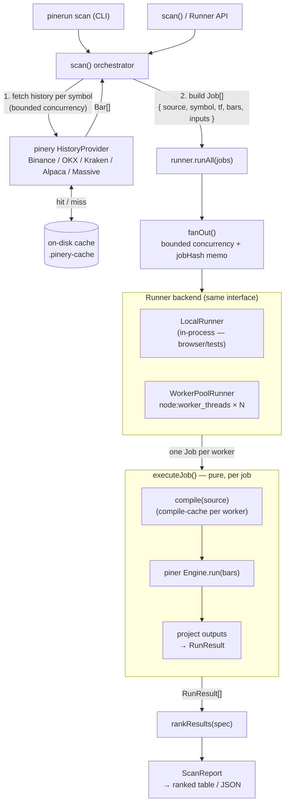

# @heyphat/pinerun

The **orchestration layer** for the [piner](https://github.com/heyphat/piner)
engine. Pinerun turns a single deterministic piner run into a programmable
fan-out: run one Pine script across many symbols — or one script across many
parameter sets on a single symbol — in parallel, then rank the results.

Because a piner run is a pure function of `(source, bars, inputs, backend)`, every
run is cacheable and reproducible — pinerun leans on that for memoization and for
trivial parallelism across worker threads.

- **Browser-safe core** (`@heyphat/pinerun`): the job model, the pure run
  primitive, an in-process runner, the ranker, the `scan` fan-out, the single-run
  `backtest`, the `sweep` parameter-optimization fan-out, and `walkforward`
  out-of-sample validation.
- **Node entry** (`@heyphat/pinerun/node`): the `WorkerPoolRunner`
  (`node:worker_threads`) for real parallelism.
- **CLI** (`pinerun`): seven verbs — `init` (scaffold a starter strategy), `scan`
  (screen many symbols), `backtest` (analyze one strategy deeply), `compare`
  (two strategies side by side), `portfolio` (one strategy, N symbols, one
  capital pot), `sweep` (optimize parameters), `walkforward` (validate the
  optimum out of sample) — plus `upgrade` (self-update the installed binary).

`piner` (`@heyphat/piner`) is a **peer dependency**; `@heyphat/pinery` is a
regular dependency (used by `scan` / `sweep` to fetch history).

## Install

The `pinerun` CLI ships as a single self-contained binary — the Bun runtime, the
piner engine, and the pinery data layer are all baked in, so there is nothing
else to install (no Node, no Bun, no npm):

```bash
curl -fsSL https://raw.githubusercontent.com/heyphat/pinestack/main/scripts/install.sh | sh
```

This downloads the right binary for your platform from the
[latest release](https://github.com/heyphat/pinestack/releases/latest) into
`~/.local/bin` (override with `PINERUN_INSTALL_DIR`; pin a tag with
`PINERUN_VERSION=v0.1.0`). Prebuilt targets: Linux and macOS on x64/arm64, plus a
Windows x64 `.exe` from the [Releases](https://github.com/heyphat/pinestack/releases)
page. macOS users may need `xattr -d com.apple.quarantine pinerun` on an unsigned
download. Once installed, `pinerun upgrade` updates the binary in place from the
latest release (checksum-verified, atomic swap).

### Build the binary from source

```bash
bun run build:bin              # this machine        → dist/pinerun
bun run build:bin --install    # this machine + copy onto your PATH
bun run build:bin linux-x64    # one target          → dist/pinerun-linux-x64
bun run build:bin all          # every platform      → dist/pinerun-<target>[.exe]
bun run build:bin --list       # supported targets
```

`--install` copies the host binary to a directory on your `PATH` (defaults to
`$PINERUN_INSTALL_DIR`, then `~/.local/bin`; override with
`--install=/usr/local/bin`). Targets: `linux-x64` `linux-arm64` `darwin-x64`
`darwin-arm64` `windows-x64` (plus `-musl` / `-baseline` variants, e.g.
`linux-x64-musl` for Alpine). Binaries are ~50–100 MB (the Bun runtime is embedded).

### Programmatic use

The packages run from TypeScript source in this workspace (`bun install`); an npm
release for external consumption is planned. Until then, consume `@heyphat/pinerun`
and `@heyphat/pinery` from a checkout — see [Quick start](#quick-start-programmatic).

## Quick start (programmatic)

```ts
import { scan, LocalRunner } from '@heyphat/pinerun';
import { WorkerPoolRunner } from '@heyphat/pinerun/node';
import { BinanceProvider } from '@heyphat/pinery';

const source = `//@version=6
indicator("RSI scan")
plot(ta.rsi(close, 14), title="rsi")
`;

const runner = new WorkerPoolRunner({ size: 4 }); // or new LocalRunner()
try {
  const report = await scan({
    source,
    symbols: ['BTCUSDT', 'ETHUSDT', 'SOLUSDT'],
    timeframe: '1h',
    provider: new BinanceProvider(),
    range: { limit: 300 },
    rank: 'last(rsi)',
    top: 10,
    runner,
  });

  for (const { result, value } of report.ranked) {
    console.log(result.symbol, value);
  }
} finally {
  await runner.close();
}
```

## Architecture

`scan()` is the orchestrator: it pulls history from **pinery**, fans the work out
across a **Runner**, and ranks what comes back. Every run is a pure function of
`(source, bars, inputs)`, which is what makes the fan-out and the memoization safe.



**The fan-out**, in ASCII — one compiled script, N symbols, run in parallel and
collapsed to a ranked table:

```
                       one Pine source
                              │
        ┌──────────┬──────────┼──────────┬──────────┐
        ▼          ▼          ▼          ▼          ▼
     Job(BTC)   Job(ETH)   Job(SOL)   Job(BNB)   Job(XRP)     ← scan() builds jobs
        │          │          │          │          │            (bars fetched via pinery)
        ▼          ▼          ▼          ▼          ▼
   ┌─────────────────── worker pool (N threads) ───────────────────┐
   │  executeJob = compile(cache) → Engine.run(bars) → RunResult    │
   └────────────────────────────────────────────────────────────────┘
        │          │          │          │          │
        └──────────┴──────────┼──────────┴──────────┘
                              ▼
                     rankResults(spec)              ← e.g. last(rsi), desc, top 10
                              ▼
                       ranked table
```

**Walkthrough of one `scan`:**

1. **Fetch** — `scan()` asks the pinery `HistoryProvider` for each symbol's bars
   (bounded concurrency). The Node disk cache serves repeats without hitting the API.
2. **Build jobs** — each `(symbol, bars)` becomes a serializable `Job` carrying the
   Pine **source string** (not a compiled object — functions can't cross a worker
   boundary).
3. **Fan out** — `runner.runAll` sends jobs through `fanOut`, which caps concurrency
   and memoizes by `jobHash` so identical `(source, bars, inputs)` never run twice.
4. **Execute** — each worker runs the pure `executeJob`: compile the source (cached
   per worker, so one script scanned across N symbols compiles once per worker), run
   piner's `Engine` over the bars, and project the outputs into a `RunResult`.
5. **Rank** — `rankResults` reduces each result to a scalar via the rank spec and
   sorts, producing the `ScanReport` the CLI prints as a table or JSON.

The two runners implement the **same `Runner` interface**, so the identical `scan`
runs in-process (`LocalRunner`, e.g. in a browser or a test) or across worker
threads (`WorkerPoolRunner`, the CLI default) with no other change.

## Concepts

### `Job` — the unit of work

A fully serializable description of one run. It carries the Pine **source string**
(never a compiled script — compiled bodies are functions and can't cross a worker
boundary):

```ts
interface Job {
  id?: string; // defaults to `${symbol}@${timeframe}`
  source: string; // Pine v6 source
  symbol: string;
  timeframe: string; // piner timeframe label (see pinery toPinerTimeframe)
  bars: Bar[]; // OHLCV, ascending by time
  inputs?: Record<string, unknown>; // input overrides keyed by input title
  mintick?: number; // instrument tick size (default 0.01)
  minQty?: number; // instrument lot step — the broker's TV-parity quantity
  //                  truncation unit for derived order sizes and margin-call
  //                  liquidations (default 0.001)
  backend?: 'js' | 'interp'; // piner backend (default 'js')
}
```

### `RunResult` — the result contract

A serializable projection of a piner run:

```ts
interface RunResult {
  id: string;
  symbol: string;
  timeframe: string;
  ok: boolean;
  bars: number; // bars executed
  plots: PlotResult[]; // { id, title, data: number[] } — NaN where `na`
  alerts: AlertResult[]; // { bar, message }
  strategy?: StrategySummary; // filled for strategy() scripts
  trades?: StrategyTrade[]; // closed-trade ledger — only when includeTrades
  equityCurve?: number[]; // per-bar equity — only when includeTrades
  barTimes?: number[]; // per-bar times aligned with equityCurve — only when includeTrades
  closes?: number[]; // per-bar close prices (price-chart input) — only when includeTrades
  securityRequests?: SecurityRequest[]; // request.security[_lower_tf] deps this run declared
  diagnostics?: string[]; // compile diagnostics ("error: ..." / "warning: ...")
  error?: string; // present when ok === false
  elapsedMs?: number;
}

interface StrategySummary {
  // sourced directly from piner's broker
  initialCapital: number;
  netProfit: number;
  netProfitPercent: number;
  grossProfit: number;
  grossProfitPercent: number;
  grossLoss: number;
  grossLossPercent: number;
  profitFactor: number; // grossProfit / |grossLoss| (derived); Infinity if no losses
  wins: number;
  losses: number;
  closedTrades: number;
  winRate: number; // wins / (wins + losses), 0..1 (derived)
  avgTrade: number;
  avgTradePercent: number;
  avgWinningTrade: number;
  avgLosingTrade: number;
  maxDrawdown: number;
  maxDrawdownPercent: number; // peak-equity based (piner), matching TradingView
  maxRunup: number;
  maxRunupPercent: number;
  maxContractsHeld: number;
  evens: number; // break-even closed trades
  totalCommission: number; // TradingView's "Commission Paid"
  barsProcessed: number; // bars while the strategy was active
  barsInMarket: number; // bars with an open position
  metrics: StrategyMetrics; // derived analytics, computed BY PINER (below)
}

// piner's `Engine.strategyMetrics()` projected verbatim — derived risk-adjusted
// analytics, kept distinct from the broker-verbatim numbers above.
interface StrategyMetrics {
  sharpe: number; // annualized, per-bar equity returns
  sortino: number; // Infinity when no downside and mean > 0
  volatilityPercent: number; // annualized return volatility
  cagrPercent: number;
  calmar: number; // CAGR % / max drawdown %
  exposurePercent: number; // barsInMarket / barsProcessed
  expectancy: number; // mean closed-trade profit
  maxConsecutiveWins: number;
  maxConsecutiveLosses: number;
  largestWin: number;
  largestLoss: number;
  avgBarsInTrade: number;
  buyHoldReturnPercent: number; // benchmark over the same bars
  outperformance: number; // net profit − buy-&-hold PnL on the same capital
  periodsPerYear: number; // the annualization actually used
}
```

### `executeJob(job) → Promise<RunResult>`

The single, backend-agnostic run primitive: compiles the source (with a
per-process compile cache), runs it over the job's bars via piner's `Engine`, and
projects the outputs. Pure (piner-only, no I/O), so it runs identically in-process
or inside a worker. Compile errors and runtime errors are captured into
`RunResult` (`ok: false`) rather than thrown.

### `jobHash(job) → string`

The determinism key: a fast FNV-1a hash over `source + timeframe + backend +
mintick + minQty + a numeric digest of the bars + inputs + metrics options`. Two jobs with
identical inputs hash equal (so results memoize); changing any input changes the
hash.

## Runners

All runners implement one interface:

```ts
interface Runner {
  run(job: Job): Promise<RunResult>;
  runAll(jobs: Job[], opts?: RunAllOptions): Promise<RunResult[]>;
  close(): Promise<void>;
}

interface RunAllOptions {
  concurrency?: number; // max jobs in flight (default: pool size; 4 for LocalRunner)
  onResult?: (r: RunResult, done: number, total: number) => void;
  noCache?: boolean; // skip determinism memo (default false)
}
```

### `LocalRunner`

Runs jobs in-process (browser-safe). Ideal for tests, small scans, and the
browser. `runAll` uses `fanOut` for bounded concurrency + per-hash memoization.

### `WorkerPoolRunner` (`@heyphat/pinerun/node`)

Real parallelism via `node:worker_threads`. Same `Runner` contract, so it's a drop
-in for `LocalRunner`. Each worker keeps its own compile cache, so scanning one
script across N symbols compiles once per worker.

```ts
import { WorkerPoolRunner } from '@heyphat/pinerun/node';

const runner = new WorkerPoolRunner({ size: 8 }); // default: CPU count, clamped 1..16
// ... use runner.run / runner.runAll ...
await runner.close(); // terminate the pool when done
```

> Note: always `await runner.close()` when finished, and if you drive a runner
> from a script's top level, use **top-level `await`** rather than a
> fire-and-forget promise — otherwise the runtime can tear down live worker
> threads before the promise settles.

### `fanOut(jobs, exec, opts?)`

The shared bounded-concurrency scheduler with per-`jobHash` memoization. Both
runners build on it; exported for custom execution strategies.

## Ranking

Reduce each `RunResult` to a single scalar via a small, safe spec grammar (no
`eval`) and sort.

```ts
import { parseRankSpec, evalRank, rankResults } from '@heyphat/pinerun';
```

**Spec forms:**

| Spec                 | Meaning                                       |
| -------------------- | --------------------------------------------- |
| `last(rsi)`          | aggregate `last` over the plot titled `rsi`   |
| `max(#0)`            | aggregate `max` over plot index 0 (id-sorted) |
| `mean(close)`        | aggregate `mean` over the plot titled `close` |
| `last`               | bare aggregate over the **first** plot        |
| `strategy.netProfit` | a strategy summary field (broker-verbatim)    |
| `strategy.sharpe`    | a derived risk-adjusted metric                |

**Aggregates:** `last first min max mean sum count` (`count` = non-NaN samples).
NaN values are ignored inside aggregates.

**Strategy fields (broker-verbatim):** `initialCapital`, `netProfit`, `netProfitPercent`,
`grossProfit`, `grossProfitPercent`, `grossLoss`, `grossLossPercent`, `profitFactor`,
`wins`, `losses`, `evens`, `closedTrades`, `winRate`, `avgTrade`, `avgTradePercent`,
`avgWinningTrade`, `avgLosingTrade`, `maxDrawdown`, `maxDrawdownPercent`, `maxRunup`,
`maxRunupPercent`, `maxContractsHeld`, `totalCommission`, `barsProcessed`, `barsInMarket`.

**Derived metric fields** (live under `strategy.metrics` on the summary, rank with the
same flat `strategy.<field>` grammar): `sharpe`, `sortino`, `volatilityPercent`,
`cagrPercent`, `calmar`, `exposurePercent`, `expectancy`, `maxConsecutiveWins`,
`maxConsecutiveLosses`, `largestWin`, `largestLoss`, `avgBarsInTrade`,
`buyHoldReturnPercent`, `outperformance`.

```ts
const spec = parseRankSpec('last(rsi)');
const ranked = rankResults(results, spec, { direction: 'desc', top: 20 });
// RankedResult[] = { result: RunResult, value: number }[]
```

`rankResults` options: `direction` (`'asc'`|`'desc'`, default `desc`), `top`
(keep top N), `dropNaN` (drop failed/empty results, default `true`).

## `scan(options) → ScanReport`

The flagship fan-out: fetch history for each symbol, build jobs, run them through
a `Runner`, and rank. Browser-safe (pass any `HistoryProvider` and any `Runner`).

```ts
interface ScanOptions {
  source: string;
  symbols: string[];
  timeframe: string; // canonical pinery tf (e.g. "1h"), mapped internally
  provider: HistoryProvider;
  range?: HistoryRange;
  rank?: string; // rank spec, default "last"
  direction?: 'asc' | 'desc';
  top?: number;
  concurrency?: number; // job execution default: worker-pool size (4 for LocalRunner)
  backend?: 'js' | 'interp';
  inputs?: Record<string, unknown>;
  mintick?: number; // tick-size override; unset → provider instrument metadata
  minQty?: number; // lot-step override; unset → provider instrument metadata
  includeTrades?: boolean; // attach ledger + equity curve (strategies)
  metrics?: JobMetricsOptions; // { periodsPerYear?, riskFreeRate? } for derived metrics
  runner?: Runner; // default new LocalRunner()
  onResult?: (r, done, total) => void;
  onFetch?: (symbol, bars) => void;
  onFetchError?: (symbol, error) => void;
}

interface ScanReport {
  spec: RankSpec;
  ranked: RankedResult[]; // sorted, top-N applied
  results: RunResult[]; // every run (incl. failures), symbol order
  errors: RunResult[]; // runs that failed (compile/runtime)
  fetchErrors: { symbol: string; error: string }[];
}
```

`scan` maps the canonical `timeframe` to piner's label with pinery's
`toPinerTimeframe`, fetches history with bounded concurrency, and continues past
per-symbol fetch failures (collected in `fetchErrors`).

On a live terminal, long `scan` and `sweep` runs show a self-erasing progress
line on stderr (`scan: 132/500 ran · 2 errors · 12.3s · ~40s left`); when
stderr is piped (CI, logs) it never prints, so captured output stays clean.

## CLI

Once installed, invoke the `pinerun` binary directly:

```bash
pinerun init        [file.pine]    [options]
pinerun scan        <script.pine> [options]
pinerun backtest    <script.pine> [options]
pinerun compare     <a.pine> <b.pine> [options]
pinerun portfolio   <script.pine> [options]
pinerun sweep       <script.pine> [options]
pinerun walkforward <script.pine> [options]
pinerun upgrade     [--check]
```

Every command takes `--help` for its full flag list (e.g. `pinerun scan --help`),
and `pinerun --version` (or `-v`) prints the CLI version and build commit.
During development, run the CLI straight from source instead of building the
binary: `bun packages/pinerun/src/cli.ts <command> …`.

### `init` — scaffold a starter strategy

New to Pine? `init` writes a complete, heavily commented `strategy()` you can run
immediately — no Pine writing required. The scaffold explains how a strategy
works (inputs, per-bar execution, entries/exits) and opens with copy-paste
`backtest` / `sweep` / `walkforward` recipes whose `--input` names already match
the script's `input()` titles.

```bash
pinerun init                              # → strategy.pine (SMA cross)
pinerun init rsi-bot.pine --template rsi  # a commented RSI starter
```

```
--template <name>     Starter to scaffold (default sma-cross):
                        sma-cross (trend) | rsi (mean-reversion) |
                        bollinger (breakout) | macd (momentum)
--name "Title"        strategy() title (default: a per-template label)
--force               Overwrite the file if it already exists
--stdout              Print the source to stdout instead of writing a file
```

It refuses to clobber an existing file without `--force`, and `--stdout` prints
the source without writing (pipe or preview). The four templates mirror the
[`examples/`](../../examples) strategy library. Programmatic: `starterStrategy({
template, name })` in [`scaffold.ts`](./src/scaffold.ts) is a pure, browser-safe
string builder — only the CLI touches the filesystem.

### `scan`

```
--symbols a,b,c       Inline symbol list (comma/space separated)
--universe <file>     File of symbols (one per line; # comments allowed)
--tf <1h>             Timeframe: 1m 5m 15m 1h 4h 1d 1w (default 1h)
--from <date>         Start (ISO date or unix seconds)
--to <date>           End (ISO date or unix seconds)
--limit <n>           Max bars per symbol
--rank <spec>         Ranking spec (default "last"), e.g. last(rsi), max(#0),
                        strategy.netProfit, strategy.sharpe
--top <n>             Keep only the top N
--asc                 Sort ascending (default descending)
--trades              Attach the closed-trade ledger + equity curve (a single-
                        symbol scan prints a PRICE chart + ledger; always in --json)
--no-chart            Skip the table sparklines — indicator scans get a SERIES
                        column (the ranked plot, per symbol); strategy scans
                        get an EQUITY column when the curve is retained
                        (--trades / --csv / --plot) — and the PRICE chart a
                        single-symbol --trades scan prints above its ledger
--periods-per-year <n> Metrics annualization override (e.g. 252 daily US-equity
                        bars; default: empirical bar times / 24/7 timeframe)
--risk-free-rate <r>  Annual risk-free rate for Sharpe/Sortino, as a fraction
                        (e.g. 0.02; default 0)
--csv <dir>           Write <label>-trades.csv + <label>-equity.csv per ranked
                        strategy result (pandas/Excel-ready; implies --trades)
--plot <dir>          Write a self-contained <label>.html equity + drawdown
                        chart per ranked strategy result (implies --trades)
--concurrency <n>     Max jobs in flight (default = workers)
--workers <n|local>   Worker threads (default = CPUs; "local" = in-process)
--backend js|interp   piner backend (default js)
--provider binance    Data provider (default binance): binance | okx | kraken |
                        alpaca | massive
--asset-class <cls>   Asset class for multi-class providers (binance/okx:
                        crypto | futures; default: the provider's default)
--no-cache            Disable the on-disk history cache
--no-security         Skip request.security resolution (cross-symbol / lower-TF
                        fetch + inject); those requests degrade to na
--cache-dir <dir>     Cache directory (default .pinery-cache)
--refresh             Refresh cached history
--json                Emit JSON instead of a table
```

`--symbols` and `--universe` may be combined; symbols are de-duplicated. By
default history is fetched through the Binance provider wrapped in pinery's
on-disk cache, so repeat scans hit no network.

#### Credentials for the equities providers (security)

The crypto exchanges (Binance / OKX / Kraken) need no key. **Alpaca** and
**Massive** do — and the safe way to supply it is **environment variables**, not
CLI flags. A key passed as `--api-key`/`--api-secret` is written to your shell
history file and is visible to anyone who can run `ps`, so prefer:

```bash
export ALPACA_API_KEY_ID=…                # Alpaca key id
export ALPACA_API_SECRET_KEY=…            # Alpaca secret
export MASSIVE_API_KEY=…                   # Massive key
# then just name the provider — no key on the command line:
pinerun scan strat.pine --provider alpaca --symbols AAPL,MSFT --tf 1d
```

The equities adapters read these env vars automatically when the flag is absent.
`--api-key`/`--api-secret`/`--feed iex|sip` still exist (scripted/CI use, or
overriding an env var) but the CLI prints a warning when a credential is passed on
the command line — treat that as a nudge to switch to the env vars above.

### Examples

```bash
# Rank a symbol list by current RSI, top 10, across worker threads
pinerun scan examples/rsi.pine \
  --symbols BTCUSDT,ETHUSDT,SOLUSDT,BNBUSDT,XRPUSDT \
  --tf 1h --limit 300 --rank "last(rsi)" --top 10

# Read symbols from a file, a fixed date range, JSON output for piping
pinerun scan rsi.pine \
  --universe universe.txt --tf 1d --from 2023-01-01 --to 2024-01-01 \
  --rank "mean(rsi)" --json

# Deterministic in-process run (no worker threads)
pinerun scan rsi.pine --symbols BTCUSDT --workers local

# Backtest a strategy across a universe, ranked by net profit
pinerun scan examples/sma-cross-param.pine \
  --symbols BTCUSDT,ETHUSDT,SOLUSDT,BNBUSDT,XRPUSDT \
  --tf 1h --limit 500 --rank "strategy.netProfit" --top 3
```

Sample table output:

```
  #  SYMBOL            VALUE  BARS  SERIES
  ------------------------------------------------------
   1 ETHUSDT         50.9528  299    ▂▆▇█▇█▇▅▆▄▄▅▄▄▅█▆█▅
   2 BTCUSDT         47.3813  299    ▂▅██▆█▇▅▅▄▅▆▄▄▇█▆▆▅
   3 BNBUSDT         43.2215  299    ▂▅▇█▆█▇▅█▄▅▆▃▅▆▇▅▇▅
   4 SOLUSDT         40.1425  299    ▂▆▇▇▆▇▄▃▅▄▅▅▂▃▅▇▄▅▄
   5 XRPUSDT         38.3130  299    ▂▆▇█▆█▇▄▄▄▄▄▂▄▅▇▅▆▃

  rank="last(rsi)"  5/5 ran  5 ranked  in 48ms
```

### `sweep`

```
--symbol <sym>        Single symbol to backtest across the grid
--symbols a,b,c       Multi-symbol grid: every combo on every symbol (the symbol
                        becomes an implicit axis; bars fetched once per symbol)
--universe <file>     File of symbols for the multi-symbol grid (as scan)
--input name=spec     Swept input axis (REPEATABLE): list (fast=5,10,20) or
                        range (slow=30:100:10); name must match a Pine input() title
--sample <n>          Smart search: run n randomly sampled combos instead of the
                        exhaustive grid (the --max-combos guard applies to n)
--seed <n>            PRNG seed for --sample (default 42; same seed → same combos)
--heatmap             Print the 2-axis optimization surface as a value grid
                        (requires exactly two --input axes)
--points-csv <file>   Write every run as one CSV row (symbol, axes, value,
                        strategy stats, error) — pandas-ready, no ledgers needed
--tf <1h>             Timeframe (default 1h)
--from/--to/--limit   History window
--rank <spec>         Metric to optimize (default strategy.netProfit for a
                        strategy, else "last"), e.g. strategy.profitFactor,
                        strategy.sharpe
--top <n>             Keep only the top N combos
--asc                 Sort ascending (default descending)
--periods-per-year <n>  Metrics annualization override (as scan)
--risk-free-rate <r>  Annual risk-free rate for Sharpe/Sortino (as scan)
--csv <dir> / --plot <dir>  Per-combo CSV / HTML exports (as scan, labeled
                        <symbol>-<combo>)
--max-combos <n>      Cap on total runs: combos × symbols (default 5000; checked
                        before fetch)
--trades              Attach ledger + equity curve; prints the winning combo's
                        PRICE chart + ledger, and adds an EQUITY sparkline
                        column to the ranked table
--no-chart            Skip the table sparklines (EQUITY / SERIES columns) and
                        the winning combo's PRICE chart
--concurrency <n>     Max jobs in flight (default = workers)
--workers <n|local>   Worker threads (default = CPUs; "local" = in-process)
--backend js|interp   piner backend (default js)
--provider <name>     Data provider (default binance)
--no-security         Skip request.security resolution
--no-cache            Disable the on-disk history cache
--cache-dir <dir>     Cache directory (default .pinery-cache)
--refresh             Refresh cached history
--json                Emit JSON instead of a table
```

See [Sweep — parameter optimization](#sweep--parameter-optimization) for the axis
grammar, examples, and the programmatic API.

## Strategies

pinerun runs Pine **strategies** as well as indicators. When a scanned script is a
`strategy(...)`, `executeJob` drives piner's broker over the bars and attaches a
`StrategySummary` (see the result contract above) to each `RunResult`. Every metric
is read straight off piner (the `strategy.*` namespace, the broker's own
`profitFactor` / `winRate` convenience getters, and `Engine.strategyMetrics()` for
the derived risk-adjusted block under `strategy.metrics`) — **pinerun performs no
strategy calculations of its own**, so all numbers match what a Pine script /
TradingView reports (e.g. `maxDrawdownPercent` is peak-equity based). A strategy
scan is a **parallel multi-symbol backtest**: one strategy, N symbols, ranked by
performance.

The derived metrics annualize from the run's real bar times by default; pass
`--periods-per-year` (e.g. 252 for daily US-equity bars) and/or `--risk-free-rate`
(annual fraction, e.g. 0.02) — or `scan({ metrics: { periodsPerYear, riskFreeRate } })`
— to apply a market-calendar convention.

Rank by any summary metric via the `strategy.<field>` spec —
`strategy.netProfit`, `strategy.profitFactor`, `strategy.winRate`, and the derived
`strategy.sharpe`, `strategy.sortino`, `strategy.calmar`, `strategy.cagrPercent`,
`strategy.outperformance`, plus the rest listed under [Ranking](#ranking). The CLI
**auto-detects a strategy scan**, defaults the rank to `strategy.netProfit` (unless
you pass `--rank`), and prints a backtest table instead of the single-value table:

```bash
# examples/sma-cross-param.pine — an SMA crossover strategy
pinerun scan examples/sma-cross-param.pine \
  --symbols BTCUSDT,ETHUSDT,SOLUSDT,BNBUSDT,XRPUSDT --tf 1h --limit 500
```

```
  #  SYMBOL        NET P/L      NET %  TRADES    WIN%    MAXDD%       PF   SHARPE      B&H %
  ------------------------------------------------------------------------------------------
   1 SOLUSDT        946.98      9.47%       8  50.00%    12.50%     2.06     3.25     17.90%
   2 XRPUSDT       -559.68     -5.60%       5  40.00%     8.00%     0.19     1.43     -0.64%
   3 BTCUSDT       -576.31     -5.76%       7  28.57%     9.51%     0.18     0.46     -2.67%
   4 BNBUSDT       -764.15     -7.64%       7  14.29%    12.06%     0.17    -2.90     -6.57%
   5 ETHUSDT       -861.44     -8.61%       7  28.57%    12.39%     0.13     0.82      5.37%

  rank="strategy.netProfit"  5/5 ran  5 ranked  in 177ms
```

### Trade ledger + equity curve

Pass `--trades` (or `scan({ includeTrades: true })`) to attach the full
closed-trade ledger (`result.trades`), per-bar equity curve
(`result.equityCurve`), and close prices (`result.closes`). On a single-symbol
scan the CLI prints the **PRICE** chart (close line with the trades marked at
their fill prices, as in `backtest`) followed by the ledger; with `--json`
everything is always included. Printed ledgers longer than 20 trades elide to
the first and last 5 rows with an `…` row carrying the omitted count — the
full ledger always lives in `--csv` / `--json`.

```bash
pinerun scan examples/sma-cross-param.pine \
  --symbols SOLUSDT --tf 1h --limit 500 --trades
```

```
  trades for SOLUSDT (8):
   #  DIR           QTY         ENTRY          EXIT        PROFIT           CUM        FEES
  -----------------------------------------------------------------------------------------
   1  long       144.91       69.0100       73.5300        654.98        654.98      0.0000
   2  long       144.20       73.8900       73.2800      -87.9623        567.02      0.0000
   ...
   8  long       133.11       75.4800       82.2400        899.82        946.98      0.0000
```

Each `StrategyTrade` is `{ entryId, dir (+1/-1), qty, entryPrice, exitPrice,
entryBar, exitBar, entryTime, exitTime, profit, cumProfit, commission, maxRunup,
maxDrawdown }` — fill times are bar-time ms, `commission` is both sides' fees on
the row, and `maxRunup`/`maxDrawdown` are the trade-life intrabar excursions.

Programmatically:

```ts
import { scan } from '@heyphat/pinerun';
import { BinanceProvider } from '@heyphat/pinery';
import { readFileSync } from 'node:fs';

const report = await scan({
  source: readFileSync('examples/sma-cross-param.pine', 'utf8'),
  symbols: ['BTCUSDT', 'ETHUSDT', 'SOLUSDT'],
  timeframe: '1h',
  provider: new BinanceProvider(),
  range: { limit: 500 },
  rank: 'strategy.profitFactor',
  includeTrades: true,
});

for (const { result } of report.ranked) {
  const s = result.strategy!;
  console.log(
    result.symbol,
    s.netProfit.toFixed(2),
    `${s.netProfitPercent.toFixed(1)}%`,
    `PF ${s.profitFactor.toFixed(2)}`,
    `${result.trades!.length} trades`,
  );
}
```

> `StrategySummary` + the ledger are a projection of piner's broker report. For
> deeper detail (OCA groups, per-order events, intrabar equity), run piner's
> `Engine` directly — pinerun's `executeJob` is a thin wrapper over it.

### CSV export + equity plot

`--csv <dir>` and `--plot <dir>` (both imply `--trades`) export every **ranked
strategy result** — top-N applied, indicator scripts skipped:

```bash
pinerun scan examples/sma-cross-param.pine \
  --symbols SOLUSDT,BTCUSDT --tf 1h --limit 500 --csv out/ --plot out/
# out/SOLUSDT-trades.csv  out/SOLUSDT-equity.csv  out/SOLUSDT.html  (and BTCUSDT…)
```

- `<label>-trades.csv` — the full ledger, one row per closed trade:
  `symbol,entryId,dir,qty,entryPrice,exitPrice,entryBar,exitBar,entryTime,exitTime,profit,cumProfit,commission,maxRunup,maxDrawdown`
  (times as ISO 8601 UTC, RFC 4180 quoting).
- `<label>-equity.csv` — `bar,time,equity`, every bar emitted; bars before the
  strategy activated have an empty equity cell (pandas reads NaN).
- `<label>.html` — a dependency-free page: equity curve with the initial-capital
  reference and green/red per-trade exit markers, over an underwater drawdown-%
  chart.

On `sweep` the label is `<symbol>-<combo>` (e.g. `BTCUSDT-fast=10_slow=50`), so a
`--top 10 --csv out/` sweep drops the ten best combos' ledgers side by side.

```python
import pandas as pd
trades = pd.read_csv('out/SOLUSDT-trades.csv', parse_dates=['entryTime', 'exitTime'])
equity = pd.read_csv('out/SOLUSDT-equity.csv', parse_dates=['time'], index_col='time')
```

The underlying builders are exported, pure, and browser-safe — the CLI only adds
the file writes: `tradesToCsv(result)`, `equityToCsv(result)`, and
`equityPlotHtml(result, { title? })` each return a string from a `RunResult` that
carries `trades` / `equityCurve` / `barTimes` (i.e. ran with `includeTrades`).

## Backtest — single-strategy tearsheet

Where `scan` answers _"which symbols does this strategy work on?"_, `backtest`
answers _"how good is this strategy, exactly?"_ — one script, one symbol, full
detail:

```bash
pinerun backtest examples/sma-cross-param.pine \
  --symbol SOLUSDT --tf 1h --limit 500
```

```
  backtest: SOLUSDT @ 1h — 500 bars, 2026-06-14 → 2026-07-05

  RETURNS
    net profit                  946.98       9.47%
    gross profit               1838.98      18.39%
    gross loss                  892.00       8.92%
    buy & hold                              17.90%
    outperformance             -843.33
    CAGR                                   390.10%

  RISK
    max drawdown               1358.59      12.50%
    max runup                  1670.64      17.57%
    volatility (annual)                     53.22%
    sharpe                        3.25
    sortino                       2.28
    calmar                       31.20
    exposure                                48.40%

  TRADES
    closed trades                    8  (4W 4L 0E)
    win rate                                50.00%
    profit factor                 2.06
    expectancy                  118.37
    avg win / loss        459.75 / 223.00
    largest win / loss    899.82 / -406.80
    max consecutive       2 win / 3 loss
    avg bars in trade            30.25
    commission paid             0.0000
    max contracts held          152.31

  initial capital 10000.00 · annualized at 8766.00 periods/yr · in 16ms
```

The ledger, equity curve, and bar times are **always** computed, so `--trades`
(print the ledger), `--csv <dir>` / `--plot <dir>` (export), and `--json` (the
full `RunResult`) need no extra flags. The stats blocks are followed by three
analysis tables: **MONTHLY RETURNS %** (year × month grid, green/red on a TTY),
**TOP DRAWDOWNS** (the five deepest episodes with peak/trough/recovery dates
and durations; `—` + `>N` marks one still underwater), and **TRADE P/L
DISTRIBUTION** (a bucketed histogram of closed-trade profits — zero is always
a bucket edge, so every bar is purely wins or purely losses). Then three
in-terminal charts (the histogram and charts skip with `--no-chart`; the
tables always print): the **PRICE** panel — the close series as a braille line
with every trade marked at its actual fill price: `▲` long / `▼` short entry,
`●` winning / `○` losing exit, colored cyan / green / red on a TTY while piped
output stays plain unicode (the glyphs carry the same information) — then the
**EQUITY** chart (braille line with a dashed initial-capital guide and a date
axis) and the **DRAWDOWN** underwater strip.

**Live mode:** `--watch [sec]` (default 60, min 5) refreshes history, reruns,
and redraws the tearsheet in place every cycle — a paper-trading dashboard for
free. It requires a live terminal (refuses when piped) and is incompatible
with `--json`; Ctrl-C exits. Fixed input overrides use
`--input name=value` (repeatable, ONE value each — grids are `sweep`'s job) and
are validated against the script's `input()` titles before anything runs.
Indicator scripts are rejected with a pointer to `scan`; strategies only.

Programmatic:

```ts
import { backtest } from '@heyphat/pinerun';

const { result, fetchError } = await backtest({
  source, // Pine v6 strategy
  symbol: 'SOLUSDT',
  timeframe: '1h', // canonical pinery tf
  provider: new BinanceProvider(),
  range: { limit: 500 },
  inputs: { fast: 10, slow: 50 }, // fixed overrides (optional)
  metrics: { periodsPerYear: 252 }, // annualization convention (optional)
  // mintick?, backend?, resolveSecurity? (default true), onFetch?
});
// result.strategy  → StrategySummary (broker-verbatim + derived metrics)
// result.trades / result.equityCurve / result.barTimes / result.closes → always attached
// priceChartAscii(result.closes, { trades: result.trades, times: result.barTimes })
```

A backtest is a single `executeJob` — no runner/worker pool involved — so it also
runs in the browser with any `HistoryProvider`.

## Compare — two strategies, same bars

`backtest` answers _"how good is this strategy?"_; `compare` answers _"which of
these two?"_ — two scripts (or one script under two input sets) run on the same
symbol and bars, printed side by side:

```bash
# two different strategies
pinerun compare examples/sma-cross-param.pine examples/rsi-mean-reversion.pine \
  --symbol BTCUSDT --tf 1h --limit 500

# one strategy, two parameterizations
pinerun compare strat.pine strat.pine --symbol BTCUSDT --tf 1h \
  --input-a fast=5 --input-b fast=20 --label-a fast-5 --label-b fast-20
```

```
  compare: SOLUSDT @ 1h — 499 bars, 2026-06-19 → 2026-07-10

                                 A: fast-5      B: fast-20
    ------------------------------------------------------
    net profit %                    -1.48%          11.30%
    profit factor                     0.91            2.74
    max drawdown %                  12.33%           7.46%
    sharpe                            0.12            5.28
    ...

  EQUITY %  ⣿ A: fast-5  ⣿ B: fast-20  (dashed = 0%)
    <both curves on one chart, A cyan / B yellow>
```

The metric table covers returns, risk, and trade quality for both sides; the
equity curves are normalized to % return (so different `initial_capital`s
compare fairly) and overlaid on one chart — **A cyan, B yellow** on a TTY.
Piped output can't rely on color, so it prints two stacked monochrome charts
instead. Flags: `--input-a` / `--input-b` (repeatable, one value each,
validated per script), `--label-a` / `--label-b` (default: the filenames),
`--no-chart`, `--json` (both full `RunResult`s), plus the usual
history/provider/backend/metrics flags. Strategy scripts only.

The overlay builder is exported and pure: `overlayChartAscii(a, b, { times,
guide, color, fmtLabel })` draws any two aligned series on a shared scale.

## Sweep — parameter optimization

Where `scan` fans one script out over **N symbols**, `sweep` fans one script out
over **N parameter combinations**: the cartesian product of a set of input axes,
run in parallel and ranked. It's the same fan-out (same `Job` model, `jobHash`
memo, `Runner`, and ranker) — only the job generation differs, so it inherits all
the parallelism and determinism for free. Pass several symbols (`--symbols`) and
the grid widens to `symbols × combos` — the symbol becomes an implicit axis, bars
still fetched once per symbol.

Each combo becomes a `Job` whose `inputs` override the script's `input(...)`
values **by title**, so the swept names must match the Pine input titles. Lift any
hardcoded constant into an `input(...)` to make it sweepable:

```pine
fastLen = input.int(10, "fast")   // now overridable by --input fast=...
slowLen = input.int(30, "slow")
fast = ta.sma(close, fastLen)
slow = ta.sma(close, slowLen)
```

```
                 one Pine source, one symbol's bars
                              │
   ┌───────────┬─────────────┼─────────────┬───────────┐
   ▼           ▼             ▼             ▼           ▼
Job(5,30)   Job(5,50)   Job(10,30)   Job(10,50)  …          ← cartesian(axes)
   └───────────┴─────────────┼─────────────┴───────────┘       (bars fetched ONCE)
                             ▼
                  worker pool → executeJob (per combo)
                             ▼
                     rankResults(spec)                      ← e.g. strategy.netProfit
                             ▼
                  ranked table (a column per axis)
```

### CLI

```bash
pinerun sweep examples/sma-cross-param.pine \
  --symbol BTCUSDT --tf 1h --limit 500 \
  --input fast=5,10,15,20 --input slow=30:100:10 --top 10
```

```
  sweep: BTCUSDT — 32 combos, ranked by strategy.netProfit (fast × slow)

  #  fast  slow       NET P/L      NET %  TRADES    WIN%    MAXDD%       PF   SHARPE
  ----------------------------------------------------------------------------------
   1   10    40       -148.43     -1.48%       5  40.00%     4.23%     0.13     3.10
   2   10    50       -156.22     -1.56%       5  20.00%     5.57%     0.39     2.56
   ...

  32/32 ran  10 ranked  in 85ms
```

Like `scan`, `sweep` **auto-detects a strategy** (defaults the rank to
`strategy.netProfit` unless you pass `--rank`) and prints a backtest table with one
column per swept axis; an indicator sweep prints a single `VALUE` column instead.

**Axis grammar** — each `--input name=spec` (repeatable) expands to a value list:

| Spec                 | Expands to         | Meaning                                 |
| -------------------- | ------------------ | --------------------------------------- |
| `fast=5,10,20`       | `[5, 10, 20]`      | explicit list (a comma always wins)     |
| `slow=30:100:10`     | `[30, 40, …, 100]` | inclusive range `start:stop:step`       |
| `len=5:8`            | `[5, 6, 7, 8]`     | range, default step 1                   |
| `fast=5,10:20:5`     | `[5, 10, 15, 20]`  | a list member may itself be a range     |
| `useStop=true,false` | `[true, false]`    | booleans                                |
| `mult=.5,1.5,2`      | `[0.5, 1.5, 2]`    | floats (leading-dot / `1e3` forms work) |
| `src=close`          | `["close"]`        | single value                            |

Tokens coerce to number / boolean / string automatically. Every axis is
validated against the script's declared inputs **before any fetch**: an axis
name that matches no `input()` title errors out (piner would otherwise silently
ignore it and every combo would run identical defaults), and a value whose type
doesn't match the input kind (a string reaching an `input.int`) errors instead
of silently running as `na`. The total run count (combos × symbols) is capped by
`--max-combos` (default 5000), also checked before any fetch.

Sweep-specific flags (everything else — `--tf --from --to --limit --rank --top
--asc --trades --concurrency --workers --backend --provider --api-key --api-secret
--feed --periods-per-year --risk-free-rate --csv --plot --no-security --no-cache
--cache-dir --refresh --json` — matches `scan`):

```
--symbol <sym>        Single symbol to backtest across the grid
--symbols / --universe  Multi-symbol grid (symbol becomes an implicit axis)
--input name=spec     Swept input axis (REPEATABLE); name must match a Pine input() title
--sample <n> / --seed <n>  Seeded random subset instead of the exhaustive grid
--heatmap             2-axis optimization surface as a text grid
--points-csv <file>   The whole surface as CSV, one row per run
--max-combos <n>      Cap on total runs: combos × symbols (default 5000)
```

### Multi-symbol grids, smart search, heatmap, points CSV

**Multi-symbol grid** — `--symbols a,b,c` (or `--universe <file>`) runs every
combo on every symbol. Bars are fetched once per symbol (bounded concurrency)
and shared across that symbol's combos; a symbol whose fetch fails is skipped
and reported (`fetchErrors`) without sinking the rest. The table gains a
`SYMBOL` column, exports are labeled `<symbol>-<combo>`, and the budget guard
counts `combos × symbols`.

**Smart search** — `--sample 200` swaps the exhaustive grid for 200 randomly
sampled distinct combos, so a `fast=1:100 slow=1:100` grid (10,000 combos)
becomes tractable; `--max-combos` then applies to the sampled count. Sampling
is seeded (`--seed`, default 42) and deterministic: the same seed reruns the
same combos. Combos are decoded straight from their grid index
(`comboAt`/`sampleCombos` in `params.ts`) — the full cartesian product is never
materialized.

**Heatmap** — with exactly two swept axes, `--heatmap` prints the classic
optimization surface (first axis down the rows, second across the columns, the
ranked metric in each cell; `·` marks failed or sampled-out cells; one grid per
symbol on a multi-symbol sweep). On a TTY the cells grade **red → yellow →
plain → green → bright green** by value quintile, so the robust plateau (broad
green regions, what you actually want) stands out from a lucky spike; piped
output stays plain:

```
  strategy.netProfit by fast (rows) × slow (cols)

  fast     30      50
     5  -28.4   175.7
    10  192.3  -120.0
    15  413.2   -46.3
```

**Points CSV** — `--points-csv out/points.csv` writes EVERY run (not just the
ranked top) as one row: symbol, one column per axis, the ranked value, the
strategy summary block, and the error for failed runs. Unlike `--csv` it needs
no trade ledgers, so it's cheap on huge grids and pivots straight into a pandas
/ Excel optimization surface. Programmatic: `sweepPointsToCsv(report)` /
`sweepHeatmap(report)` are pure string builders exported from the package root.

### Try it — scenario commands

Run these from the repo root; the on-disk history cache makes repeats fast:

```bash
# Multi-symbol grid — a SYMBOL column, one fetch per symbol, ranked across all symbols
pinerun sweep examples/sma-cross-param.pine \
  --symbols BTCUSDT,ETHUSDT,SOLUSDT --tf 1h --limit 500 \
  --input fast=5,10 --input slow=30,50 --top 10

# 2-axis heatmap under the ranked table
pinerun sweep examples/sma-cross-param.pine \
  --symbol BTCUSDT --tf 1h --limit 500 \
  --input fast=5:20:5 --input slow=30:100:10 --heatmap

# Multi-symbol + heatmap — one grid per symbol
pinerun sweep examples/sma-cross-param.pine \
  --symbols BTCUSDT,ETHUSDT --tf 1h --limit 500 \
  --input fast=5,10,15 --input slow=30,50 --heatmap

# Smart search — an 11k-combo grid sampled down to 50 runs
pinerun sweep examples/sma-cross-param.pine \
  --symbol BTCUSDT --tf 1h --limit 500 \
  --input fast=2:60 --input slow=10:200 --sample 50 --top 10

# Seed determinism — rerun with the same --seed and the table is identical;
# change the seed and the sampled combos change
pinerun sweep examples/sma-cross-param.pine \
  --symbol BTCUSDT --tf 1h --limit 500 \
  --input fast=2:60 --input slow=10:200 --sample 10 --seed 7

# Sampled heatmap — combos the sample skipped print as ·
pinerun sweep examples/sma-cross-param.pine \
  --symbol BTCUSDT --tf 1h --limit 500 \
  --input fast=5:20:5 --input slow=30:100:10 --sample 12 --heatmap

# Points CSV — every run as one row, cheap (no ledgers)
pinerun sweep examples/sma-cross-param.pine \
  --symbols BTCUSDT,ETHUSDT --tf 1h --limit 500 \
  --input fast=5,10,15 --input slow=30,50 --points-csv out/points.csv

# JSON — check symbols, combos, gridTotal, sample, and per-point symbol fields
pinerun sweep examples/sma-cross-param.pine \
  --symbols BTCUSDT,ETHUSDT --tf 1h --limit 300 \
  --input fast=5,10 --input slow=30 --sample 1 --json
```

Guard / failure paths — all fail fast with a clean message before any fetch:

```bash
# Budget counts combos × symbols: 4 combos × 2 symbols = 8 > 5
pinerun sweep examples/sma-cross-param.pine \
  --symbols BTCUSDT,ETHUSDT --tf 1h --input fast=5,10 --input slow=30,50 --max-combos 5

# An oversized exhaustive grid suggests --sample
pinerun sweep examples/sma-cross-param.pine \
  --symbol BTCUSDT --tf 1h --input fast=1:100 --input slow=1:100

# --heatmap with only one axis is rejected
pinerun sweep examples/sma-cross-param.pine \
  --symbol BTCUSDT --tf 1h --input fast=5,10 --heatmap

# A non-integer --sample is rejected
pinerun sweep examples/sma-cross-param.pine \
  --symbol BTCUSDT --tf 1h --input fast=5,10 --sample 2.5

# A bad symbol in a multi-symbol grid is reported but doesn't sink the rest
pinerun sweep examples/sma-cross-param.pine \
  --symbols BTCUSDT,NOTAREALSYM --tf 1h --limit 300 --input fast=5,10 --input slow=30
```

Regression check — `walkforward` drives `sweep` internally per window, so it
should behave exactly as before these additions:

```bash
pinerun walkforward examples/sma-cross-param.pine \
  --symbol BTCUSDT --tf 1h --limit 2000 \
  --input fast=5,10,15 --input slow=30,50 --windows 3
```

### Programmatic — `sweep(options) → SweepReport`

```ts
import { sweep, parseAxes } from '@heyphat/pinerun';
import { WorkerPoolRunner } from '@heyphat/pinerun/node';
import { BinanceProvider } from '@heyphat/pinery';
import { readFileSync } from 'node:fs';

const runner = new WorkerPoolRunner({ size: 8 });
try {
  const report = await sweep({
    source: readFileSync('examples/sma-cross-param.pine', 'utf8'),
    symbol: 'BTCUSDT',
    timeframe: '1h',
    provider: new BinanceProvider(),
    range: { limit: 500 },
    axes: parseAxes(['fast=5,10,15,20', 'slow=30:100:10']), // or build Axis[] by hand
    rank: 'strategy.netProfit',
    top: 10,
    runner,
  });

  for (const { inputs, result, value } of report.ranked) {
    console.log(inputs, value, `${result.strategy!.netProfitPercent.toFixed(1)}%`);
  }
} finally {
  await runner.close();
}
```

```ts
interface Axis {
  name: string;
  values: unknown[];
} // name = a Pine input() title

interface SweepOptions {
  source: string;
  symbol?: string; // single symbol…
  symbols?: string[]; // …or a multi-symbol grid (symbols × combos)
  timeframe: string; // canonical pinery tf (e.g. "1h"), mapped internally
  provider: HistoryProvider;
  range?: HistoryRange;
  axes: Axis[]; // the input grid (cartesian product)
  baseInputs?: Record<string, unknown>; // fixed inputs applied under every combo
  rank?: string; // default: strategy.netProfit for strategies, else "last"
  direction?: 'asc' | 'desc';
  top?: number;
  concurrency?: number; // default: worker-pool size (4 for LocalRunner)
  backend?: 'js' | 'interp';
  mintick?: number;
  includeTrades?: boolean;
  metrics?: JobMetricsOptions; // { periodsPerYear?, riskFreeRate? } for derived metrics
  resolveSecurity?: boolean; // default true (resolved once, shared across combos)
  maxCombos?: number; // default 5000; throws before I/O when exceeded
  sample?: number; // smart search: run N random combos instead of the grid
  seed?: number; // PRNG seed for sample (default 42, deterministic)
  runner?: Runner; // default new LocalRunner()
  onResult?: (r, done, total) => void;
  onFetch?: (symbol, bars) => void;
}

interface SweepPoint {
  symbol: string; // the symbol this run executed on
  inputs: Record<string, unknown>;
  result: RunResult;
  value: number;
}

interface SweepReport {
  symbol: string; // display label (comma-joined when multi-symbol)
  symbols: string[]; // every requested symbol
  rank: string; // the EFFECTIVE rank spec (reflects the strategy default)
  spec: RankSpec;
  axes: Axis[];
  total: number; // runs executed (== points.length == combos × fetched symbols)
  combos: number; // combos per symbol (full grid, or the sampled count)
  gridTotal: number; // full cartesian size — > combos when sample was used
  ranked: SweepPoint[]; // sorted, top-N applied; NaN dropped, ±Infinity kept
  points: SweepPoint[]; // every run, symbols outermost then cartesian order
  errors: RunResult[]; // runs that failed (compile/runtime)
  warnings: string[]; // non-fatal caveats (e.g. dynamic request.security)
  fetchErrors: { symbol: string; error: string }[]; // symbols whose fetch failed
  fetchError?: string; // set when EVERY symbol's fetch failed
}
```

The axis grammar is exported for building/validating axes yourself: `parseAxes`,
`parseAxis`, `parseSpec`, `coerceToken`, `expandRange`, `cartesian`, `comboAt`,
`sampleCombos`, `comboId`, `countCombos`, `assertComboBudget`,
`DEFAULT_MAX_COMBOS`, `DEFAULT_SAMPLE_SEED` — plus the sweep exporters
`sweepPointsToCsv` and `sweepHeatmap`.

## Walk-forward — out-of-sample validation

A sweep picks the best combo on historical data; that combo is usually fit to
noise. `walkforward` asks the only question that matters: **does the edge survive
on data the optimizer never saw?**

History is split into N windows. In each window the grid is swept on the
**in-sample** (IS) segment, the winner is picked by `--rank`, and that winner is
measured on the following **out-of-sample** (OOS) segment. OOS segments tile the
tail of history back to back, so every OOS bar is traded by parameters chosen
strictly on earlier data. `--windows 1` is the plain IS/OOS split; `--anchored`
grows the IS from bar 0 instead of rolling it.

```bash
pinerun walkforward examples/sma-cross-param.pine \
  --symbol BTCUSDT --tf 1h --limit 2000 \
  --input fast=5,10,15,20 --input slow=30:100:10 --windows 5
```

```
  walk-forward: BTCUSDT — 5 windows (IS 375 → OOS 125 bars, rolling), rank strategy.netProfit

  #  IS SPAN                   OOS SPAN                  WINNER            IS NET%  OOS NET%  TRADES     EFF
  ----------------------------------------------------------------------------------------------------------
   1 2026-05-24 → 2026-06-09   2026-06-09 → 2026-06-14   fast=10|slow=30     2.01%     3.98%       1    5.95
   2 2026-05-29 → 2026-06-14   2026-06-14 → 2026-06-19   fast=10|slow=30     5.87%    -0.74%       3   -0.38
   3 2026-06-04 → 2026-06-19   2026-06-19 → 2026-06-24   fast=20|slow=40     7.57%    -3.28%       2   -1.30
   4 2026-06-09 → 2026-06-24   2026-06-24 → 2026-06-30   fast=10|slow=40     4.44%    -1.10%       2   -0.74
   5 2026-06-14 → 2026-06-30   2026-06-30 → 2026-07-05   fast=10|slow=40    -0.96%     4.13%       1      na

  aggregate: OOS positive 2/5 · mean IS 3.79% · mean OOS 0.60% · WFE 0.47 · in 272ms
```

Read the verdict off the aggregate: **WFE** (walk-forward efficiency) is per-bar
OOS profit ÷ per-bar IS profit across all windows — ≈ 1 means the edge holds out
of sample, ≪ 1 (like the 0.47 above) means the sweep was fitting noise. Also
watch OOS-positive counts and whether the winning combo is _stable_ across
windows (a different winner every window is itself a red flag).

**How OOS is measured (no warmup bias).** Each window's winner runs over the full
window (IS + OOS): the IS stretch doubles as indicator warmup, and — since a
piner run is deterministic bar by bar — its IS prefix is identical to the sweep
run that selected it (covered by a test). OOS performance is the equity-curve
difference across the boundary; OOS trades are those that exit in the segment
(a position opened in-sample and carried across counts, as it would live). Both
are plain arithmetic on piner outputs.

Walk-forward flags: `--windows <n>` (default 5), `--oos <f>` (OOS share of each
window, default 0.25), `--anchored`; everything else — `--input` axes, `--rank`,
history/provider/backend/metrics flags, `--max-combos`, `--json` — matches
`sweep`. Strategy scripts only (indicators are rejected). The table ends with an
**OOS EQUITY** sparkline per window — each winner's out-of-sample equity segment,
so "did the edge survive" is visible per row next to its OOS NET% (skip with
`--no-chart`).

Programmatic — `walkforward(options) → WalkforwardReport`:

```ts
import { walkforward } from '@heyphat/pinerun';

const report = await walkforward({
  source, // Pine v6 strategy
  symbol: 'BTCUSDT',
  timeframe: '1h',
  provider: new BinanceProvider(),
  range: { limit: 2000 },
  axes: parseAxes(['fast=5,10,15,20', 'slow=30:100:10']),
  windows: 5, // default 5; 1 = plain IS/OOS split
  oosFraction: 0.25, // default
  anchored: false, // default: rolling IS
  rank: 'strategy.sharpe', // winner selector (default strategy.netProfit)
  // baseInputs?, concurrency?, backend?, mintick?, metrics?, maxCombos?, runner?
});
// report.windows[i]: { isFrom/isTo/oosFrom/oosTo (+times), winner, winnerId,
//   isProfitPercent, oosProfitPercent, oosTrades, efficiency, result }
// report.aggregate: { oosPositive, meanIsProfitPercent, meanOosProfitPercent,
//   walkForwardEfficiency, windows, failed }
```

The window planner is exported too: `planWindows(totalBars, windows, oosFraction,
anchored)` returns the bar-index plan (`isFrom/isTo/oosFrom/oosTo`, half-open).

> **Bars are fetched once** and shared across every combo (the worker pool also
> serializes the shared series to each worker once, not once per combo).
> `request.security` dependencies are likewise resolved once — with one caveat:
> if a dependency's symbol/timeframe is _computed from a swept input_ (rare), a
> single resolution can't cover every combo; use `--no-security` for that case.
> When a sweep's script has _dynamic_ (runtime-computed) `request.security`
> arguments, the report carries a warning (`report.warnings`, echoed by the CLI)
> so this can't go unnoticed.

> **Overfitting.** Picking the single best of many combos usually fits past noise,
> not a durable edge. Treat sweep as _candidate generation_ and validate the
> winner on data it never saw (out-of-sample / walk-forward) before trusting it.

## Portfolio — one strategy, N symbols, ONE capital pot

`scan` answers _"which symbol is best?"_. `portfolio` answers the question a quant
actually trades on: **run this strategy across the whole basket out of one
account.** It fans out the fetch exactly like `scan`, then hands the injected bars
to piner's `PortfolioEngine` — N per-symbol engines driven on the union clock of
all sleeves' bar times — and reads back one portfolio equity curve, a merged
symbol-tagged ledger, and a tearsheet computed by piner's `computeStrategyMetrics`.

Two capital models, selected with `--mode`:

- **`isolated`** (default) — N sub-accounts, each funded `wᵢ·P`. This equals
  running each symbol standalone and summing the equity curves; it's the
  equal-weight (or, with `--weights`, weighted-allocation) baseline. Piner proves
  the engine reproduces that per-symbol sum bit-for-bit.
- **`shared`** — one pot. `percent_of_equity` sizing, funds checks, margin, and
  `strategy.risk.*` rules all read **portfolio** equity, and sleeves compete for
  capital in basket order at each timestamp. This is a genuinely different
  backtest — one symbol's gains fund another's next entry, and an order can be
  rejected because an earlier sleeve already spent the cash.

```bash
pinerun portfolio examples/sma-cross-param.pine \
  --symbols BTCUSDT,ETHUSDT,SOLUSDT --tf 1h --limit 500 --mode shared --capital 30000
```

```
  portfolio: 3 symbols @ 1h — mode=shared, 30000.00 initial, 2026-06-18 → 2026-07-09

  RETURNS
    net profit                 53.3355       0.18%
    ...
  RISK
    max drawdown               3646.57      11.80%
    sharpe                        0.32
    exposure                                56.91%
    (portfolio drawdown/run-up are close-to-close on the combined curve)
  TRADES
    closed trades                   11  (4W 7L 0E)
    margin calls                     0

  SYMBOL               FUNDING     NET P/L  TRADES  CONTRIB%  RET-CORR
  --------------------------------------------------------------------
  BTCUSDT              (pot)     -843.32       3   -1581.2        na
  ETHUSDT              (pot)     -792.76       2   -1486.4        na
  SOLUSDT              (pot)     1689.41       6    3167.5        na

  3/3 sleeves combined  annualized at 8766.00 periods/yr  in 14ms
```

The contribution table attributes portfolio net profit to each sleeve; in
`isolated` mode `RET-CORR` is each sleeve's per-bar return correlation with the
portfolio (a diversification read), shown `na` under `shared` mode where every
sleeve's curve samples the shared pot.

Under the contribution table, an isolated-mode basket of two or more sleeves
prints the **SLEEVE RETURN CORRELATION** matrix — every pairwise per-bar return
correlation, the direct answer to "do I hold four strategies or one strategy
four times?" (skipped in `shared` mode, where sleeve curves sample the pot and
every pair would read 1.00). The portfolio tearsheet also carries the same
**MONTHLY RETURNS**, **TOP DRAWDOWNS**, and **TRADE P/L DISTRIBUTION** blocks
as `backtest`, computed on the combined curve and merged ledger.

The tearsheet ends with **in-terminal charts** (skip with `--no-chart`): the
combined equity curve as a braille line chart with a dashed initial-capital
guide, the close-to-close underwater drawdown, and one cumulative-P/L sparkline
per sleeve — plain unicode, no colors, safe to pipe or log. The same builders
are exported for programmatic use: `equityChartAscii(equity, { times, capital,
width, height })`, `priceChartAscii(closes, { times, trades, color })`,
`drawdownChartAscii(equity, opts)`, `sparkline(values, width)`.

Terminal charts run across the CLI, wherever the data is present (all skippable
with `--no-chart`): `backtest` ends its tearsheet with a **PRICE** panel (close
line, trades marked at their fill prices — `▲`/`▼` entries, `●` win / `○` loss
exits, colored on a TTY) plus the same equity +
drawdown charts; `compare` overlays both strategies' normalized equity curves
on one chart (A cyan / B yellow on a TTY, stacked monochrome charts when
piped); `scan` adds a `SERIES` sparkline of the ranked plot per row
(indicator scans) or an `EQUITY` sparkline per symbol (strategy scans with
`--trades`/`--csv`/`--plot`), and a single-symbol `--trades` scan prints the
PRICE chart above its ledger; `sweep` gains the same `EQUITY` column per combo
under `--trades` plus the winning combo's PRICE chart, and `--heatmap` cells
grade red → green on a TTY; `walkforward` shows each window's **OOS equity
segment** as a sparkline — the "did the edge survive out of sample" question,
answered per row at a glance. `portfolio` charts equity only: a basket mixes
price scales, so per-trade context lives in the per-sleeve CSV/HTML exports
instead. The `backtest` and `portfolio` tearsheets also print **MONTHLY
RETURNS**, **TOP DRAWDOWNS**, and **TRADE P/L DISTRIBUTION** blocks (see the
backtest section) — pure-text tables that survive any pipe.

**Portfolio drawdown/run-up are close-to-close** on the combined curve, in both
modes — the sleeves' worst intrabar moments don't coincide and cross-symbol
intrabar paths are unknowable, so this is the honest number (per-sleeve reports
keep their own intrabar extremes). No buy-&-hold benchmark: it's meaningless for
a basket.

Flags: `--symbols`/`--universe` (basket, priority order); `--mode
isolated|shared`; `--capital <P>` (default N × the script's initial_capital);
`--weights sym=frac,...` (isolated only; normalized); `--input` (applied to every
sleeve); `--trades`/`--csv`/`--plot`/`--json`; plus the usual
history/provider/backend/metrics flags. `--csv` writes `portfolio-equity.csv` +
`portfolio-trades.csv` (symbol-tagged, exit-time sorted) plus per-sleeve files;
`--plot` writes `portfolio.html` + per-sleeve charts. A symbol that fails to fetch
is dropped with a warning (under `shared` mode a smaller basket is a _different_
backtest, so it's called out loudly). Strategy scripts only.

> **CSV clocks.** In `portfolio-trades.csv` the `entryBar`/`exitBar` columns are
> **sleeve-local** bar indices (they join that symbol's `<SYMBOL>-equity.csv`),
> while `portfolio-equity.csv`'s `bar` column is the **master clock**. To join
> trades against the combined curve, key on `entryTime`/`exitTime` instead.

### Try it — scenario commands

Run these from the repo root; the on-disk history cache makes repeats fast:

```bash
# Isolated baseline (default) — N equal-weight sub-accounts; equals running each
# symbol standalone and summing the equity curves. RET-CORR reads diversification.
pinerun portfolio examples/sma-cross-param.pine \
  --symbols BTCUSDT,ETHUSDT,SOLUSDT --tf 1h --limit 500

# Shared pot — one account, sleeves compete for capital in basket (priority) order
pinerun portfolio examples/sma-cross-param.pine \
  --symbols BTCUSDT,ETHUSDT,SOLUSDT --tf 1h --limit 500 --mode shared --capital 30000

# Weighted isolated — fund BTC 50%, ETH 30%, SOL 20% of the pot (normalized)
pinerun portfolio examples/sma-cross-param.pine \
  --symbols BTCUSDT,ETHUSDT,SOLUSDT --tf 1h --limit 500 \
  --capital 30000 --weights BTCUSDT=0.5,ETHUSDT=0.3,SOLUSDT=0.2

# Basket from a universe file + fixed input override applied to every sleeve
pinerun portfolio examples/sma-cross-param.pine \
  --universe universe.txt --tf 1d --limit 365 --input fast=10 --input slow=50

# Merged ledger + CSV/HTML exports (portfolio-*.csv, portfolio.html, per-sleeve files)
pinerun portfolio examples/sma-cross-param.pine \
  --symbols BTCUSDT,ETHUSDT,SOLUSDT --tf 1h --limit 500 --mode shared \
  --trades --csv out/ --plot out/

# JSON — full report (equityCurve, summary, metrics, sleeves, fetchErrors) for piping
pinerun portfolio examples/sma-cross-param.pine \
  --symbols BTCUSDT,ETHUSDT,SOLUSDT --tf 1h --limit 500 --mode shared --json
```

Programmatic — `portfolio(options) → PortfolioReport`:

```ts
import { portfolio } from '@heyphat/pinerun';

const report = await portfolio({
  source, // Pine v6 strategy
  symbols: ['BTCUSDT', 'ETHUSDT', 'SOLUSDT'],
  timeframe: '1h',
  provider: new BinanceProvider(),
  range: { limit: 500 },
  mode: 'shared', // 'isolated' (default) | 'shared'
  capital: 30000, // default: N × the script's initial_capital
  weights: { BTCUSDT: 0.5, ETHUSDT: 0.3, SOLUSDT: 0.2 }, // isolated only
  // inputs?, backend?, mintick?, concurrency?, metrics?, resolveSecurity?
});
// report.equityCurve / times (master clock), initialCapital, summary (StrategySummary),
// metrics (StrategyMetrics), trades (merged, symbol-tagged), sleeves (contribution),
// fetchErrors (dropped symbols), mode, elapsedMs
```

The exact multi-symbol capital semantics (what `strategy.equity` reads under a
shared pot, fill ordering, per-sleeve margin against shared cash, portfolio-level
risk halts) are specified in piner's `docs/portfolio-semantics.md` — TradingView
has no multi-symbol strategy, so pinestack defines and versions these itself.

The pure alignment helpers are exported for building the post-hoc sum yourself
(the oracle the engine is validated against): `combineEquity(sleeves)`,
`unionTimes`, `alignEquity`, `returnCorrelation`.

## Cross-symbol & multi-timeframe (`request.security`)

piner never fetches — it declares its data dependencies and reads host-injected
bars. `scan()` resolves that automatically (enabled by default; disable with
`resolveSecurity: false` / `--no-security`):

1. **Discover** — read the script's `request.security[_lower_tf]` dependencies from
   piner's **compile-time metadata** (`ScriptMetadata.securityDependencies`), with no
   run. Only when a dependency's symbol/timeframe is _dynamic_ (computed at runtime)
   does `scan` fall back to a one-off discovery run under a sentinel symbol (the
   sentinel distinguishes a `syminfo.tickerid` self-reference from a literal that
   happens to match a scanned symbol). Scripts with no `request.security` — the common
   case — cost zero discovery work.
2. **Plan + fetch** — each unique dependency is fetched **once** through the pinery
   provider (with the disk cache) and shared across every job; only self lower-TF
   is fetched per scanned symbol.
3. **Inject + run** — resolved bars ride on each `Job.securityBars`; the parallel
   run resolves every request in a single pass (no na-then-resolve).

| Request                                                         | Handling                                                                         |
| --------------------------------------------------------------- | -------------------------------------------------------------------------------- |
| Same-symbol HTF (`request.security(syminfo.tickerid, "1D", …)`) | no fetch — piner resamples each job's own bars                                   |
| Cross-symbol (`request.security("SPX", "1D", …)`)               | fetch SPX at the chart TF once, shared; piner resamples to the requested HTF     |
| Cross-symbol `security_lower_tf`                                | fetch the symbol at a finer TF, key `symbol@tf`; piner buckets intrabars per bar |
| Self `security_lower_tf(syminfo.tickerid, "1", …)`              | fetch each scanned symbol at a finer TF                                          |

```bash
# Relative strength vs a benchmark — ETHUSDT is fetched once and shared across the scan
pinerun scan examples/rs-vs-eth.pine \
  --symbols BTCUSDT,SOLUSDT,BNBUSDT --tf 1h --limit 300 --rank "last(rs)"
```

A dependency whose fetch fails or is disabled degrades to `na` (HTF) / `[]`
(lower-TF) — exactly piner's no-feed behavior. Each run also surfaces what it
asked for on `RunResult.securityRequests`.

> **Time units.** pinery/pinerun carry `Bar.time` in unix **seconds** (ergonomic
> for CLI dates and cache keys); piner's engine expects **milliseconds** (its
> daily/weekly/session bucketing uses ms). `executeJob` (and pinery's `toDataFeed`)
> convert at the engine boundary, so `request.security` HTF bucketing and
> `time()`/`dayofweek`/session builtins compute correctly.

> Dependency discovery is **static-first**: it reads piner's compile-time
> `securityDependencies` and only runs a discovery pass when a symbol/timeframe is
> dynamic. `RunResult.securityRequests` still reports what each run declared.

## API summary

**`@heyphat/pinerun`**

- Job: `Job`, `Bar`, `JobMetricsOptions`, `jobId`
- Result: `RunResult`, `PlotResult`, `AlertResult`, `StrategySummary`, `StrategyTrade`, `StrategyMetrics`
- Run: `executeJob`, `jobHash`
- Runners: `Runner`, `RunAllOptions`, `LocalRunner`, `fanOut`
- Ranking: `Aggregate`, `RankSpec`, `RankedResult`, `RankOptions`, `parseRankSpec`,
  `evalRank`, `rankResults`, `sortRanked`, `selectPlot`
- Scan: `ScanOptions`, `ScanReport`, `scan`
- Backtest: `BacktestOptions`, `BacktestReport`, `backtest`
- Portfolio: `PortfolioOptions`, `PortfolioReport`, `SleeveContribution`, `portfolio`;
  align helpers `Sleeve`, `unionTimes`, `alignEquity`, `combineEquity`, `returnCorrelation`
- Sweep: `SweepOptions`, `SweepReport`, `SweepPoint`, `sweep`, `validateAxes`
- Walkforward: `WalkforwardOptions`, `WalkforwardReport`, `WalkforwardWindow`,
  `WalkforwardAggregate`, `WindowPlan`, `walkforward`, `planWindows`
- CSV export: `tradesToCsv`, `equityToCsv`, `equityPlotHtml`, `sweepPointsToCsv`,
  `sweepHeatmap`, `SweepHeatmapOptions`
- Terminal charts: `EquityChartOptions`, `equityChartAscii`, `PriceChartOptions`,
  `PriceChartTrade`, `priceChartAscii`, `OverlayChartOptions`, `overlayChartAscii`,
  `drawdownChartAscii`, `sparkline` (pure string builders — the CLI's braille
  price/equity/drawdown/overlay charts, trade markers, and table sparklines)
- Tearsheet tables: `monthlyReturnsAscii`, `topDrawdownsAscii`, `drawdownEpisodes`,
  `profitHistogramAscii`, `correlationMatrixAscii` (+ their option types) — the
  MONTHLY RETURNS / TOP DRAWDOWNS / TRADE P/L / SLEEVE CORRELATION blocks as
  pure string builders
- Scaffold (`init`): `StarterTemplate`, `ScaffoldOptions`, `starterStrategy`,
  `isStarterTemplate`, `STARTER_TEMPLATES`, `STARTER_DESCRIPTIONS`, `SUGGESTED_FILE`
- Params (sweep axis grammar): `Axis`, `ComboBudgetOptions`, `parseAxes`, `parseAxis`,
  `parseSpec`, `coerceToken`, `expandRange`, `cartesian`, `comboAt`, `sampleCombos`,
  `comboId`, `countCombos`, `assertComboBudget`, `DEFAULT_MAX_COMBOS`, `DEFAULT_SAMPLE_SEED`
- Security: `resolveSecurity`, `discoverSecurityRequests`, `classifyRequests`,
  `planFromStatic`, `resolveLowerFetchTf`, `resolveSameSymbolFetchTf`, `PROBE_SYMBOL`,
  `ClassifiedRequests`, `DiscoverOptions`, `ResolveSecurityOptions`

**`@heyphat/pinerun/node`**

- Everything above, plus `WorkerPoolRunner`, `WorkerPoolOptions`

## License

[GNU AGPL-3.0](../../../piner/LICENSE) © Phat Huynh.
