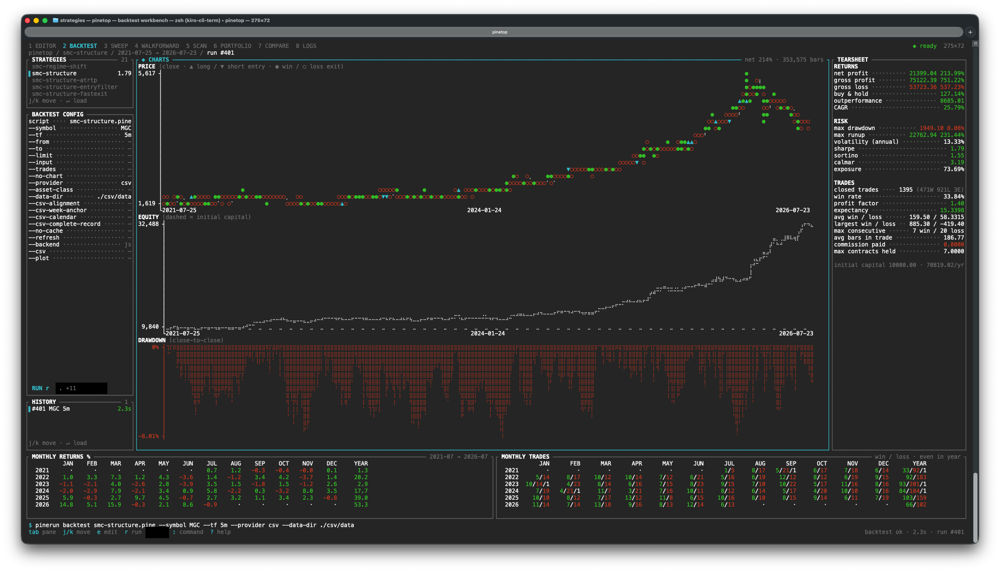
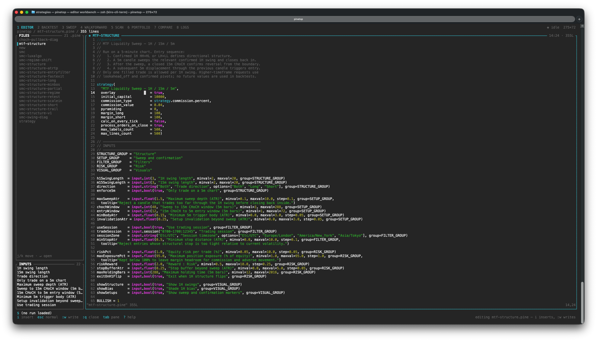

# pinetop

A terminal UI over the [`pinerun`](../pinerun) CLI. It keeps a strategy's report
resident on screen and makes the command's own flags the thing you edit, so the
**edit → rerun → reread** loop happens in place instead of through repeated shell
invocations and scrollback archaeology.

It adds no analytics of its own. Every number it shows comes from
`pinerun --json`; piner remains the sole authority for fills, timestamps, and
metrics.



## Install

pinetop ships as a prebuilt, self-contained binary alongside `pinerun` — Bun
runtime and all dependencies baked in, nothing else to install. The pinestack
installer gets both:

```sh
curl -fsSL https://raw.githubusercontent.com/heyphat/pinestack/main/scripts/install.sh | sh
```

Set `PINESTACK_BINS` to pick (`"pinerun pinetop"` by default), `PINESTACK_VERSION`
to pin a tag, `PINESTACK_INSTALL_DIR` to choose the directory (default
`~/.local/bin`).

Update in place later, the same way `pinerun` does — it resolves the latest
release, verifies the download's sha256 against the release's `checksums.txt`, and
swaps the executable atomically:

```sh
pinetop upgrade           # download and replace
pinetop upgrade --check   # just look
```

### From a checkout

```sh
cd packages/pinetop
bun run build:bin --install     # → ~/.local/bin/pinetop
```

`--install` copies the host build onto your PATH (override with
`--install=<dir>` or `$PINETOP_INSTALL_DIR`). Drop `--install` to leave it in
`dist/pinetop`. Cross-compile with a target — `bun run build:bin linux-x64`, or
`all` for every platform; `--list` shows them.

To run straight from the source tree without building:

```sh
bun packages/pinetop/src/cli.ts
```

(`upgrade` refuses from source — there is no compiled binary to replace. Use
`git pull && bun run build:bin --install`.)

**pinetop needs `pinerun` on your PATH.** It shells out for every number it shows
(§4.1.a), and refuses to start if it cannot run `pinerun --version` — that check
happens before the alternate screen opens, so the message is readable. Build it
the same way if you have not already:

```sh
cd packages/pinerun && bun run build:bin --install
```

Or point at one explicitly: `pinetop --pinerun ./dist/pinerun`, or set
`$PINERUN_BIN`.

## Run

Just type it. Everything is configured in the UI — you never need to pass the
invocation on the command line:

```sh
pinetop
```

On a fresh project it loads the only `.pine` it finds (or points you at the
STRATEGIES pane if there are several), then names the two or three things left to
set. From there (on BACKTEST — page `2`):

|              |                                                                                 |
| ------------ | ------------------------------------------------------------------------------- |
| `tab`        | move to the CONFIG pane                                                         |
| `j` / `k`    | pick a flag                                                                     |
| `↵`          | edit it in place — type, `↵` to accept, `esc` to abandon                        |
| `.`          | reveal the advanced flags (`--data-dir`, `--mintick`, the magnifier overrides…) |
| `r` then `↵` | run                                                                             |

Flags are saved per project, so the second launch is already configured.

Arguments are a shortcut, never a requirement:

```sh
pinetop strats/mean-rev.pine --symbol BTC-PERP --tf 1h   # preload some flags
pinetop --page sweep                                     # open on a page
pinetop --check-flags                                    # diff the flag schema vs pinerun --help
pinetop --version                                        # also -v, or bare `version`
```

`--version` reports two lines, because pinetop computes nothing — every number it
shows came out of whichever `pinerun` it spawned, so that binary's version is half
the answer:

```console
$ pinetop --version
pinetop 0.6.1 (2bf4f60)
pinerun 0.6.1 (2bf4f60)  — spawned for every run (pinerun)
```

The same pair is in the `?` overlay's header, so you can check it without
quitting. If a number looks stale, a stale `pinerun` on your PATH is the first
thing to rule out.

## Pages

One tab per command, numbered in workflow order.

| #   | Page        | Command                     | Purpose                                            |
| --- | ----------- | --------------------------- | -------------------------------------------------- |
| 1   | EDITOR      | (the `.pine` source)        | Write — the script itself, vim keys                |
| 2   | BACKTEST    | `pinerun backtest`          | Analyze — one strategy, one symbol, full tearsheet |
| 3   | SWEEP       | `pinerun sweep`             | Optimize — one script's input grid                 |
| 4   | WALKFORWARD | `pinerun walkforward`       | Validate — does the swept edge survive OOS         |
| 5   | SCAN        | `pinerun scan`              | Screen — one script across N symbols               |
| 6   | PORTFOLIO   | `pinerun portfolio`         | Combine — N symbols, one pot                       |
| 7   | COMPARE     | `pinerun compare`           | Compare — two strategies, same bars                |
| 8   | LOGS        | (ledger of the current run) | The engine log and the fills                       |

**SWEEP and WALKFORWARD have an INPUTS pane** below STRATEGIES, listing every
`input()` the loaded script declares — the same pane EDITOR shows, plus the grid beside each swept
one. `↵` on a row opens that axis for typing (`7,14,21`, or `30:100:10`), prefilled
if it is already set; clearing it drops that axis and leaves the rest untouched.
The legend counts the axes and the combos they make, and turns red when the grid
goes over `--max-combos`.

That per-row editing is the point: `--input` is a repeatable flag, so the config
pane can only show it as one space-joined field, and adding a second axis meant
retyping the first. Walkforward gets it for the same reason and then some — it
takes the same axis grammar, and a run there is _refused_ without at least one
axis. Names the script does not declare still appear, in warn colour, because
`pinerun` will reject them and a row that vanished would hide why.

Every command page also has a **HISTORY** pane under its config, listing that
page's runs from this session, newest first. `↵` puts one back on screen — the
report _and_ the flags that produced it, so the config pane and the `$ pinerun …`
line agree with the numbers, and `r` repeats it. Twenty runs per command are
kept; older ones are dropped, because each holds a whole report.

All six command pages carry the same **STRATEGIES** pane above their config, first
in the focus ring, because all six take a `.pine` as their first argument — `↵`
loads the selected script into that page's command. `compare` takes two, so it
marks them `A` and `B`, and `↵` fills the first free slot before it starts
replacing A. LOGS has no picker: it has no command of its own.

The workflow between them is navigation, not documentation: `:` then **carry the
sweep grid into walkforward** takes SWEEP's axes, symbol and span over to
WALKFORWARD, `↵` on a ranked combo loads it into BACKTEST as fixed inputs, `↵` on
a scanned symbol or a portfolio sleeve deep-dives it. EDITOR is page 1 because the
source is where the workflow starts — every other page is downstream of the file
it edits.

Below about 105 columns there is no room for eight titles beside the run status,
so the tab bar names only the page you are on and shows the rest as bare
ordinals. `:` and `?` list them all.

## Keys

| Key                  | Action                                                            |
| -------------------- | ----------------------------------------------------------------- |
| `1`–`8`              | Switch page — a page is reached by its ordinal, never by a letter |
| `space` `1`–`8`      | Switch page — also works inside the editor buffer                 |
| `tab` / `shift-tab`  | Next / previous pane in the focus ring                            |
| the key on a pane    | Focus that pane directly — `[h]` on HISTORY, `[ch]` on CHARTS     |
| `j` / `k`, `↓` / `↑` | Move selection                                                    |
| `g` / `G`            | First / last row                                                  |
| `↵`                  | Edit the focused config flag · load selection                     |
| `r`                  | Run dialog for this page's command (`↵` on its RUN row runs)      |
| `e`                  | Edit this page's script in `$EDITOR`, then reload it              |
| `t` / `ctrl-t`       | Shell pane on the editor page — and the way back out of it        |
| `/`                  | Filter fills                                                      |
| `.`                  | Show / hide the advanced flags                                    |
| `ctrl-u`             | Clear the field being edited                                      |
| `:` or `ctrl-p`      | Command palette                                                   |
| `?`                  | Keybinding overlay                                                |
| `esc`                | Dismiss overlay · clear filter · unscope log                      |
| `ctrl-x`             | Revert pending edits                                              |
| `q`                  | Quit                                                              |

`?` is generated from the keymap table, so it always documents the real
bindings. (The design names `⌘K` for the palette; a terminal cannot see it, so
`ctrl-p` is the binding.)

**No letter switches page.** `s` used to open SWEEP and `w` WALKFORWARD, which
left the keymap with a digit for six pages, a letter for two, and nothing for
BACKTEST. Both are gone: `3` then `r` is what `s` was, and the sweep →
walkforward hand-off — which copied config, not just focus — moved to the palette
as **carry the sweep grid into walkforward**. The letters went to the panes.

### Pane keys

Six panes means five `tab` presses to reach the last one, so every pane also has
a key, printed on its own border and derived from its name:

- the **first letter** — `[s]` STRATEGIES, `[h]` HISTORY, `[i]` INPUTS, `[v]`
  VERDICT, `[u]` UNIVERSE;
- **one letter more** when two panes on the page want the same one — BACKTEST's
  CONFIG and CHARTS are `[co]` and `[ch]`, LOGS' LEDGER and ENGINE LOG are `[le]`
  and `[lo]`, PORTFOLIO's three s-panes are `[st]` `[sl]` `[su]`. The first letter
  waits for the second; `esc` abandons it;
- **shifted** when the app already uses that letter, so nothing is taken from the
  bindings above: RANKED is `[R]` because `r` runs, and EDITOR's buffer is `[E]`
  because `e` hands off to `$EDITOR`. Shift is held once for the whole key.

The keys are per page and computed from the focus ring, so a page that gains a
pane gets a working key and cannot collide with an existing one. The pane you are
_in_ hides its key — those columns go to its legend — and `?` lists the whole set
for the page you are on.

On EDITOR, while the buffer has focus, none of the above applies — the buffer
owns the keyboard, pane keys included, and the badges disappear to say so. `?`
there shows both keyboards side by side.

## The editor

Page 1 is a vim-modal editor for the `.pine` itself: the project's scripts and
the open one's `input()` titles in the sidebar, the buffer in the wide middle
with a line-number gutter and Pine syntax colouring from your terminal's palette.



It opens on the strategy you already have loaded. `tab` (or `↵` on a file in
FILES) enters the buffer; from there it is vim:

|                     |                                                             |
| ------------------- | ----------------------------------------------------------- |
| `i` `I` `a` `A` `o` | Insert · at the indent · after · at the line end · a line   |
| `h j k l` `w b e`   | By character, by word (`W B E` by WORD)                     |
| `0 ^ $` `gg G` `{}` | Line start / indent / end · first / last line · paragraph   |
| `space` `1`–`8`     | Switch page — the app's own binding, unchanged here         |
| `ctrl-p`            | Command palette, to reach any page by name                  |
| `f F t T`           | To a character on this line                                 |
| `d c y` + a motion  | `dw` `d$` `c2w` `y}` `dfx` `dgg` — and `dd` `cc` `yy`       |
| `D C Y` `x` `s` `p` | To the line end · a character · put                         |
| `>>` `<<` `J` `r`   | Indent · outdent · join · replace one character             |
| `v` `V`             | Visual · visual line, then `d` `y` `c` `>` `<`              |
| `u` `ctrl-r`        | Undo · redo (one insert is one step)                        |
| `/` `?` `n` `N`     | Search (substring, not regex) and repeat                    |
| `:w` `:wq` `:q`     | Write · write and close · close (`:q!` discards)            |
| `:e path`           | Open a file; a path with nothing behind it starts a new one |
| `ctrl-d` `ctrl-u`   | Half a window down / up (`ctrl-f` / `ctrl-b` a whole one)   |
| `:42` `:set nonu`   | Go to a line · hide the gutter                              |

Counts work where you would expect them (`3dd`, `2w`, `42G`).

**Switching pages from the buffer** is `space` then the page number — the same
binding as everywhere else in pinetop, which is why it is `space`: bare `1`–`8`
cannot do the job inside a buffer, where a digit is a vim count and `5j`, `42G`
and `3dd` all need it. So the app gained a prefix instead of the editor gaining a
dialect: `space 3` is page 3 on every page, buffer or not. `1`–`8` still work
directly anywhere outside the buffer.

Keys the buffer hands straight back to the frame, each one already meaning the
same thing on every other page:

- **`tab` / `shift-tab`** leave the pane, so the buffer is never a keyboard trap.
- **`space`** is the page prefix, above.
- **`ctrl-p`** opens the command palette, to reach a page by name.

vim leaves `ctrl-p` unbound in normal mode, and `space` there only means "one
character right", which `l` already does — so neither costs anything. Everything
else belongs to the buffer while it has focus. One exception, because it is data
rather than a binding: after `f`, `t` or `r` the next keystroke is that command's
argument, so `f<space>` finds a space and `r<space>` writes one.

- **`ctrl-c` always quits pinetop**, even mid-insert. `q` does not: inside the
  buffer it tells you to use `:q`, and everywhere else it warns once before
  discarding an unwritten buffer. Quitting on a stray `q` would throw away
  edits, which is the one thing this page must not do.

Nothing is written except by `:w`. The INPUTS outline is read from the buffer
rather than from disk, so a renamed `input()` title shows up there before you
save — and that is the same list `--input NAME` is checked against. The buffer is
not persisted between sessions, for the same reason pending parameter edits are
not: a restored unwritten buffer would be an unexplained divergence from the file
on disk.

`.` (repeat), macros, marks, named registers, visual block and regex search are
not implemented. `?` lists exactly what is bound, so an unbound key does nothing
rather than something almost-right. Whether the script compiles is still
`piner`'s answer — press `2` then `r`.

### `e` — the real editor

For anything the in-frame buffer does not cover, `e` hands the file to your actual
editor. It works from **any** page, which is the point: on BACKTEST you press `e`,
edit, come back, press `r` — the whole loop, without leaving the keyboard.

```sh
export VISUAL="nvim"        # $VISUAL wins over $EDITOR; vim is the fallback
export EDITOR="nvim -u NONE"  # arguments are honoured
```

pinetop leaves the alternate screen, hands over the terminal — so it is your real
editor, with your config, your plugins, your colourscheme — and takes the screen
back when it exits, reloading the file and refreshing the file list. vi-family
editors are opened at the line your cursor was on (`+42`); others just get the
path, since `code +42 file` would create a file called `+42`.

`e` refuses when the in-frame buffer holds unwritten changes to that same file —
your editor would open the older copy on disk and one of the two would lose. `:w`
first. An unwritten buffer for some _other_ file is not in the way and is left
untouched.

The `$EDITOR` spec is split on whitespace and run directly, never through a
shell, so nothing in that variable can be interpreted as `;` or `$(…)`. The cost
is that an argument containing spaces cannot be expressed — point `$EDITOR` at a
wrapper script if you need one.

`e` gives your editor the **whole terminal**. When you want something running
_beside_ the buffer instead, that is the shell pane below.

### `t` — a shell beside the buffer

`t` opens a real terminal as a third column on the editor page: sidebar,
buffer, shell. It is your `$SHELL`, interactive, started in the project
directory — so `git diff`, a `pinerun` invocation you want to type by hand, or
`vim` itself all run there with the source still on screen.

`t` is the everyday key. `ctrl-t` is the same toggle for the two places a bare
letter cannot reach: inside the editor buffer, where `t` is vim's till motion, and
inside the shell pane itself.

Everything you type goes to the shell, including the keys pinetop normally binds:
`ctrl-c` interrupts the child rather than quitting pinetop, `tab` completes,
`space` is a space, `t` is a `t`. Two keys get you back out:

| Key      | Leaves the pane                                                    |
| -------- | ------------------------------------------------------------------ |
| `ctrl-t` | Always — whatever the child is doing. This is the guaranteed exit  |
| `esc`    | At a shell prompt only. A full-screen program in the pane keeps it |

`ctrl-t` is a **prefix**, the way `tmux` uses one: it is reserved from the child, and
the key after it belongs to the pane. That is what pays for scrollback without taking
`PageUp` — or any other key — away from the program running inside.

| After `ctrl-t` |                                                |
| -------------- | ---------------------------------------------- |
| `k` / `j`      | Back / forward one line                        |
| `u` / `d`      | Back / forward one page                        |
| `g` / `G`      | Top of history / back to the live view         |
| `ctrl-t`       | Leave the pane                                 |
| anything else  | Abandons the prefix; the key reaches the child |

1000 lines of history are kept. While you are scrolled the border reads `↑ 47 ·
ctrl-t G to follow`, because a pane showing old output while the child keeps working
would otherwise look frozen — and typing anything returns to the live view, since
input you cannot see the result of is worse than losing your place.

Scrollback is a normal-screen thing. On the alternate screen — `vim`, `htop`, `less` —
there is no history to show and the scroll keys do nothing, which is what a real
terminal does too.

That `esc` split is deliberate. At a prompt `esc` does nothing, so it is a cheap
way out; but once the child switches to the alternate screen — vim, `htop`,
`less` — `esc` is the key that program most needs, so it goes to the child and
`ctrl-t` becomes the only exit. The pane's border says which is which: it reads
`esc / ctrl-t leaves` at a prompt and `ctrl-t leaves` when a full-screen app has
taken over.

Leaving does not kill the shell — focus returns to the pane you came from and the
session keeps running, so `t` comes back to the same prompt with your history and
working directory intact. (It returns you to the _buffer_ only if that is where you
opened it from; landing in the buffer by accident would turn every shortcut into a
vim command.)

**To close it completely, end the shell: `ctrl-d`, or `exit`.** The column
disappears the moment the child does — there is nothing left to look at — and focus
returns where the shell took it from. Quitting pinetop closes it too, and takes
whatever was running inside it: the foreground process group is signalled, not just
the shell, so a `claude` or `vim` in the pane does not survive as an orphan.

The column needs the width to be worth having: below 108 columns of body it is
dropped entirely rather than squeezing the source into nothing.

**The buffer follows the file.** Change the open `.pine` from the shell — `sed -i`,
`git checkout`, a formatter — and the editor pane reloads it, keeping your cursor
where it was. An _unwritten_ buffer is never overwritten: it says
`changed on disk — :e! to reload, :w to overwrite` and leaves your edits alone. A
file deleted underneath you keeps its buffer, marked new, so `:w` puts it back.

One rough edge to know about: a full-screen program that queries the terminal as it
exits (`claude` does) can leave a stray cursor report such as `35;3R` on the shell
prompt afterwards. It is harmless — `ctrl-u` clears the line — but it will make the
next command fail if you do not. Fixing it properly needs the pane's pty to be a
real controlling terminal, which needs `setsid` before `exec`; `Bun.spawn` cannot do
that, so the pane has no job control and no way to tell the asker from its
successor.

No native module is involved, so the single-binary install is unaffected — the
pty comes from the libc the OS already ships, reached through `bun:ffi`, and the
VT parsing is `@xterm/headless`, which is pure JavaScript and bundles into the
compiled binary.

## How it behaves

- **Every flag is settable from the UI.** The config pane edits in place; `.`
  reveals the rarely-touched ones. Nothing requires dropping back to a shell —
  that round trip is the friction the tool exists to remove.
- **Flags a choice makes mandatory appear with it.** Set `--provider csv` and
  `--data-dir` (plus the `--csv-*` assertions) show up right beneath it; pick
  `alpaca` and you get `--feed` instead. The run dialog also refuses `csv`
  without a directory and puts the cursor on the row that fixes it, rather than
  letting the run fail on its first fetch.
- **The composed command is always on screen and always runnable.** The config
  pane, the `$ pinerun …` line, and the spawned process all come from one
  `FlagModel`. If the line on screen would not run, that is a bug.
- **Nothing runs without a keypress.** Editing a flag never schedules a spawn; a
  sweep can cost minutes and a keystroke should not spend them.
- **A failed run announces itself.** When `pinerun` exits non-zero, a drawer opens
  over the bottom of the frame with every error line the engine printed, the exit
  code, and how long it took — not one truncated line in the status bar. `esc`
  dismisses it, `:` → `show the last error` brings it back, and the complete
  engine log is on LOGS either way.
- **A run that lost symbols says so too.** `scan` and `portfolio` report and
  continue past a symbol whose history will not fetch, and `sweep` past a combo
  that errored. The same drawer opens in warn colour — `SCAN — INCOMPLETE`, the
  symbols and their reasons — because the point is not the list, which the page
  already shows, but that the numbers beside it were computed over what was left.
- **No scrolling.** Content that exceeds the frame truncates, the way a terminal
  truncates. Each page declares a min-width and degrades by dropping the right
  rail before truncating a table — and says what it dropped.
- **Charts are `pinerun`'s own.** The braille price/equity/drawdown trio and the
  monthly grids are the CLI's renderers, imported, so the screen and the printed
  command cannot disagree — including their colour grading: green gains / brick
  losses in MONTHLY RETURNS, green wins / red losses per tally in MONTHLY TRADES,
  and cyan-entry / green-win / red-loss trade markers on the price chart.
  Everything else uses the terminal's ANSI palette, so it respects your theme
  (§4.7).

## Privacy

Provider keys stay in the environment (`ALPACA_API_KEY_ID`,
`ALPACA_API_SECRET_KEY`, `MASSIVE_API_KEY`). `--api-key` / `--api-secret` are
deliberately absent from pinetop's flag schema: credentials never enter the UI,
are never persisted, and are redacted from the echoed command line and the
session log.

## Per-project state

`.pinetop/` beside the project holds:

- `flags.json` — the last session's flags, so reopening resumes where you were.
  Pending parameter edits are deliberately **not** persisted; a pending edit that
  survived a restart would be an unexplained divergence from the script on disk.
- `session.jsonl` — every spawned invocation with its exit code and duration, so
  any on-screen result can be reproduced outside the app.

## Keeping the flag schema honest

pinetop models `pinerun`'s flags by hand, which can drift. `--check-flags` diffs
the schema against the CLI's own help:

```sh
pinetop --check-flags
# flag schemas agree (6 commands; api-key, api-secret, json, help, version excluded by design)
```

## Development

```sh
bun test packages/pinetop/    # Pinetop tests
bunx tsc -b                   # typecheck
```
